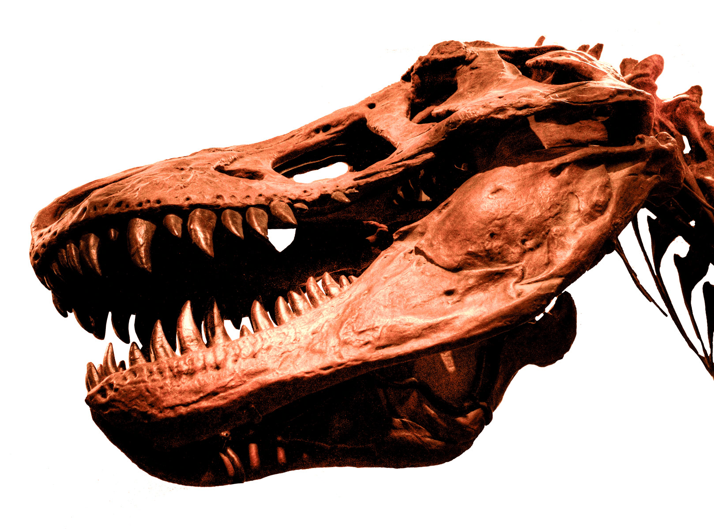

Der **Albertosaurus** war vermutlich ein schneller Läufer, der in den Wäldern unterwegs war. Man vermutet das der **Albertosuarus** im Rudel gelebt hat.

Der **Albertosaurus** hatte dreieckige Hörner vor den Augen und in seinem Kiefer saßen 60 bananenförmige Zähne.

Quellen:

* <https://www.deviantart.com>
* Schädel des Albertosaurus von  [// e_monk:](https://secure.flickr.com/photos/e_monk/)  (CC BY-NC-SA 2.0)
