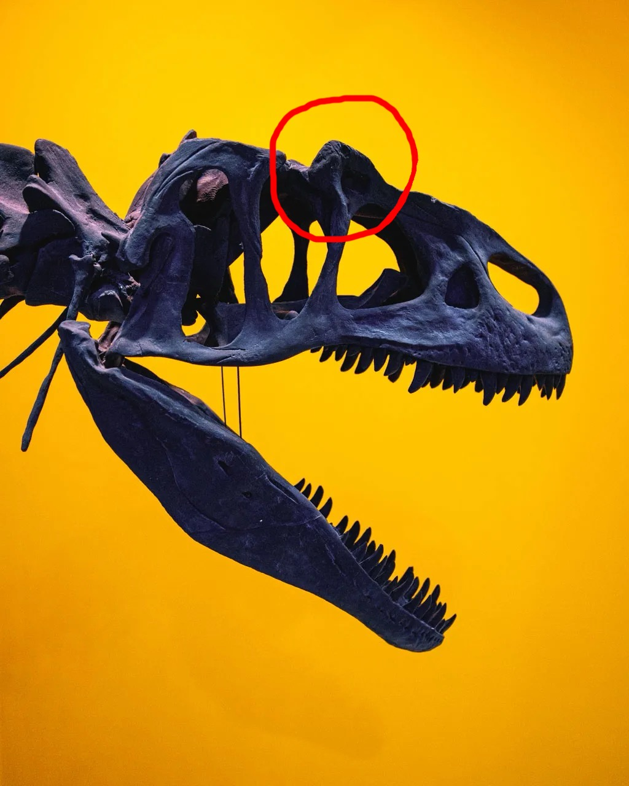
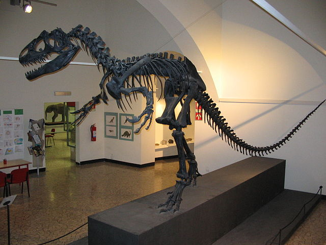
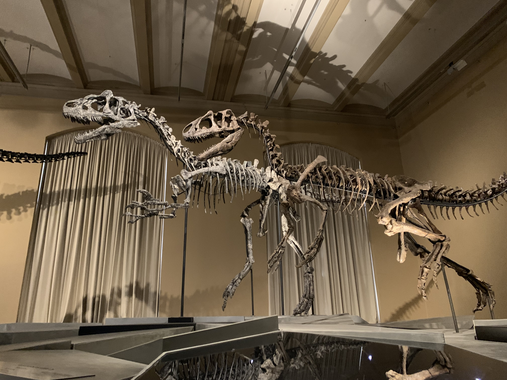

Einer der bekanntesten Raubdinosaurier war der **Allosaurus**. Er wurde schon 1877 entdeckt und ist damit ebenfalls sehr bekannt, wie [Velociraptor](/dinos/velociraptor/), [Triceratops](/dinos/triceratops/), [Stegosaurus](/dinos/stegosaurus/) und natürlich dem [Tyrannosaurus rex](/dinos/tyrannosaurus-rex/). Der **Allosaurus** war ein recht großer Dinosaurier, der in der Oberjura, vor etwa 156-144 Millionen Jahren lebte. Er war ein Karnivore und ernährte sich überwiegend von Stegosauriern und Sauropoden. Der **Allosaurus** war ein guter Jäger, sein Gebiss war mit 70 Zähnen, die sehr scharf und schmal und an der Rückseite mit kleinen Zacken versehen waren, bestückt. Es war wahrscheinlich, dass diese Räuber bei der Jagd eines Herbivoren auf einen Knochen treffen konnten und dabei einen Zahn verloren, doch dies war nicht so tragisch, da es möglich war, dass die Zähne nach dem Ausfall nach einiger Zeit nachwuchsen.  Neue Erkenntnisse zeigen, dass der **Allosaurus** einen sehr starken Biss haben musste, stärker als es die stärksten Muskeln (Muskeln, die den Kiefer schließen) können sollten. Das weist darauf hin, dass der **Allosaurus** eine besondere Jagdmethode hatte. Wahrscheinlich lief er mit weit geöffneten Kiefer auf seine Beute zu und trieb seine Zähne in dessen Fleisch. Seine Zähne ermöglichten ihm beim Zurückziehen des Kopfes ein gewaltiges Stück Fleisch aus seiner Beute zu reißen. Bei einem Angriff auf die Brust des Beutetiers war es wahrscheinlich lebensgefährlich.

Der Körperbau des **Allosaurus** war typisch für einen theropoden Dinosaurier. Er hatte einen schlanken und muskulösen Körperbau, der ihm half, schnell zu laufen und seine Beute zu verfolgen. Sein Kopf war groß und lang mit einem kräftigen Kiefer und scharfen, gezackten Zähnen. Die Augen des **Allosaurus** waren nach vorne gerichtet, was auf eine gute räumliche Wahrnehmung hinweist, eine wichtige Eigenschaft für einen Jäger. Um seine Augen zu schützen, besaß der **Allosaurus** eine Art Horn über beiden Augen.

Fotografie: Imaginario27

Sein Hals war relativ lang und flexibel, was es ihm ermöglichte, seine Beute mit seitlichen Bewegungen seines Kopfes zu ergreifen. Die Arme des **Allosaurus** waren im Vergleich zu seinen Hinterbeinen relativ kurz und endeten in drei kräftigen Krallen.
Die Hinterbeine des **Allosaurus** waren lang und muskulös und ermöglichten ihm, sich schnell und agil zu bewegen. Seine großen Hinterbeine endeten ebenfalls in scharfen Klauen.
Der Schwanz des **Allosaurus** war lang und kräftig und diente vermutlich als Ausgleich beim Rennen und gleichzeitig als Waffe gegen potenzielle Angreifer.

Bei einigen Skeletten wurden Kampfspuren bemerkt, die nur von Kämpfen zwischen ähnlichen Tieren stammen können. Diese Feststellungen werfen Zweifel auf, ob der **Allosaurus** in einer Herde oder als Einzelgänger lebte. Da aber auch mehrere **Allosaurier** an einer Stelle gefunden wurden, gibt es zwei Theorien bezüglich ihres Sozialverhaltens.

1. **Allosaurier** waren Einzelgänger und zogen sich ihre Verletzungen bei der Revierverteidigung und der Jagd zu.
2. Sie lebten in Herden, um sich gegenseitig Schutz zu geben, doch durch Machtdemonstrationen zogen sie sich Verletzungen zu.

Keine der beiden Theorien ist bisher bestätigt.

Der bedeutende Fund von "*Big Al*" im Jahr 1991 war eine besondere Entdeckung in der Paläontologie. "*Big Al*" wurde in der Morrison Formation in Wyoming, USA, entdeckt und war ein nahezu vollständiges Skelett eines **Allosaurus fragilis**.
Was "*Big Al*" besonders bemerkenswert machte, war der außergewöhnlich gute Erhaltungszustand seines Skeletts. Fast alle Knochen waren erhalten und einige waren sogar in ihrer ursprünglichen Position miteinander verbunden, was es den Paläontologen ermöglichte, ein detailliertes Bild davon zu zeichnen, wie dieser Dinosaurier gebaut war.
Zusätzlich zu den Verletzungen wies das Skelett von "*Big* *Al*" auch Anzeichen einer Infektion auf, die möglicherweise von einem Biss oder einer anderen Verletzung verursacht wurde.

\
Der **Allosaurus** wurde in zahlreichen Gattungen beschrieben, unter anderem **Allosaurus** *fragilis*. Schon 1877 beschrieb Othiniel Charles Marsh den ersten Fund von **Allosaurus**, als **Allosaurus** *fragilis*. Marshs Fund bestand jedoch nur aus zwei Wirbelknochen, einem Zahn und einem Zehenknochen. Die darauffolgenden Neubeschreibungen unterscheiden sich aber meist an den Schädelknochen. Es wurde über eine Zusammenlegung des Gattungen auf den Artnamen **Allosaurus** *fragilis* nachgedacht, dies steht aber noch nicht endgültig festgelegt. \
\
Deshalb unterscheidet man unter:

* *Allosaurus fragilis*
* *Allosaurus jimmadseni*
* *Allosaurus europaeus*
* *Allosaurus amplus*
* *Allosaurus amplus*
* *Allosaurus lucasi*
* *Allosaurus maximus*

\
Hier sind **Allosaurus** *fragilis* und **Allosaurus** *jimmadseni* im Vergleich zu sehen. *(Hinten: Allosaurus jimmadseni Vorne: Allosaurus fragilis)*

Quellen:

* <https://fr.wikipedia.org/wiki/Fichier:Allosaurus_Life_Restoration.jpg>
* <https://commons.wikimedia.org/wiki/File:Allosaurus_fragilis_skeleton_in_bergamo_2.jpg>
* <https://dinodata.de/animals/dinosaurs/pages_a/allosaurus.php?q=allosaurus>
* <https://imaginario27.com/de/projekte/allosaurus-poster/>
