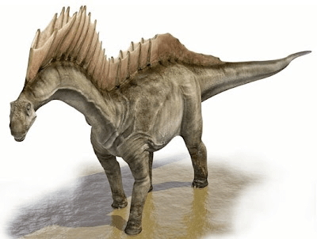
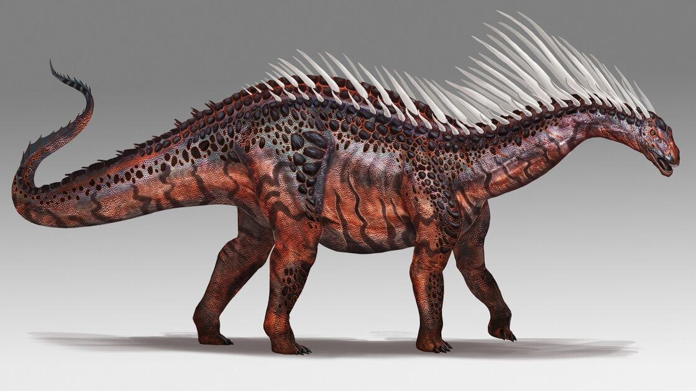

Der **Amargasaurus** ist wie die anderen Sauropoden, denn er hatte eine doppelte Stachelreihe, die in den Schwanz überlief. Mansche Wissenschaftler glauben das der **Amargasaurus** ein doppeltes Segel aus Haut gespannt hatte. Man wies nicht wozu das Segel diente, aber vielleicht hat der **Amargasaurus** es zur Balz genutzt.

Andere Wissenschaftler glauben, das kein Segel gespannt war sondern mit seinen Stacheln geklappert hat um auf sich aufmerksam zu machen.

Quellen:

* <https://www.deviantart.com/kaek/art/Amargasaurus-53159747>
* <http://blogevolved.blogspot.com/2009/09/sauropods-in-art.html>
* [https://ark.fandom.com/wiki/Mod:ARK_Additions/Amargasaurus ](https://ark.fandom.com/wiki/Mod:ARK_Additions/Amargasaurus)