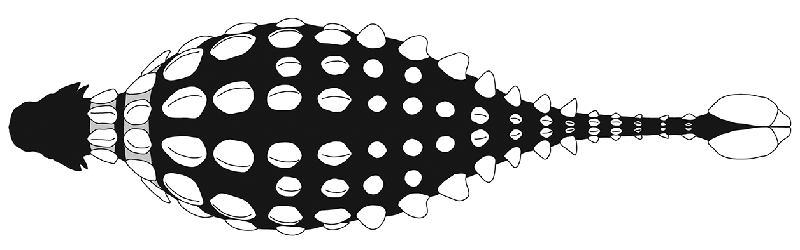
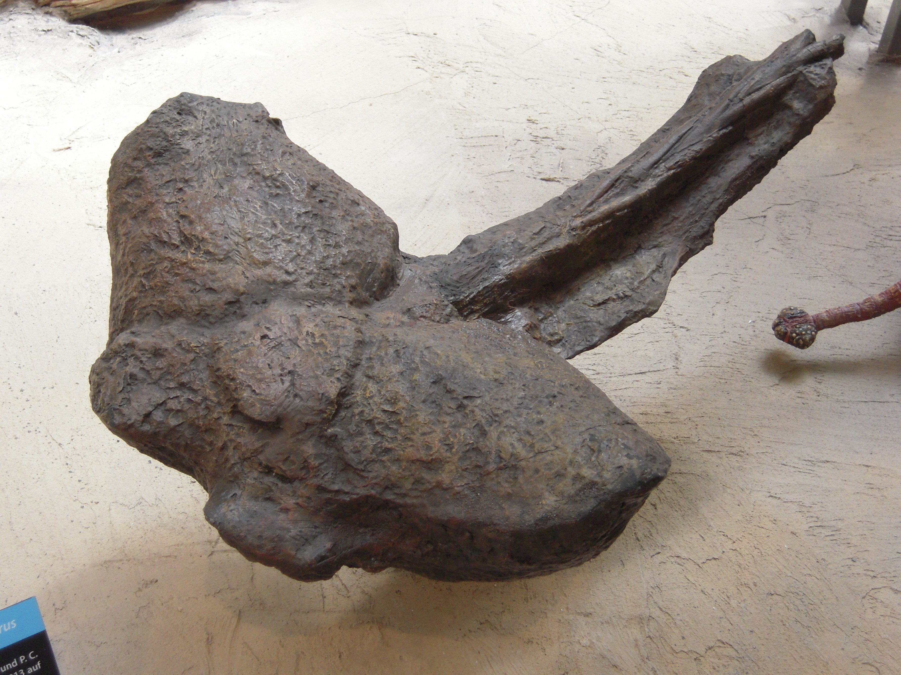

Der **Ankylosaurus** ist einer der bekanntesten gepanzerten Dinosaurier. Er lebte vor 70-66 Millionen Jahren, am Ende der Kreidezeit und teilte sich seinen Lebensraum mit berühmten Zeitgenossen wie [Tyrannosaurus rex](https://dino-fakten.de/dinos/tyrannosaurus-rex/) und [Triceratops](https://dino-fakten.de/dinos/triceratops/).

Der Körper des **Ankylosaurus** war breit, massiv und niedrig gebaut. Besonders auffällig ist seine dicke Panzerung. Der Rücken war mit großen, flachen Knochenplatten und Reihen von knöchernen Stacheln bedeckt, die sogenannten Osteodermen. Sie waren in die Haut eingelassen und variierten erheblich in der Größe. Es gab sowohl breite, flache Platten als auch schmale, runde Höcker. Die Panzerung zog sich bis zum Nacken und schützte auch den Schädel, der zudem mit Hörnern versehen war. 

Auch die Augenlider waren bei **Ankylosaurus** durch Knochenplatten geschützt, ein bei Dinosauriern eher seltenes Merkmal. Der Kopf des **Ankylosaurus** war breit und niedrig, mit einem Art Schnabel an der Vorderseite zum Abreißen von Pflanzen. Die Zähne waren klein, dreieckig und zum Zerkleinern von Pflanzen geeignet. Im Verhältnis zu seiner Körpergröße besaß er ein ungewöhnlich kleines Gehirn, was vermutlich auf ein eher einfaches Verhalten hindeutet. Die Tiere dürften überwiegend Einzelgänger gewesen sein.

Am Ende seines Schwanzes trug **Ankylosaurus** eine schwere Keule. Sie war mit den letzten Schwanzwirbeln verbunden, und kräftige Sehnen sorgten für die Beweglichkeit der Keule. Diese Schwanzkeule konnte mit einem kräftigen Schlag Knochen von Angreifern zerschmettern und diente der Verteidigung gegen große Raubsaurier wie den [Tyrannosaurus rex](https://dino-fakten.de/dinos/tyrannosaurus-rex/).

**Ankylosaurus** war ein Pflanzenfresser, der vermutlich vor allem niedrig wachsende Pflanzen, Farne, Sträucher fraß. Aufgrund seines schweren Körperbaus bewegte er sich langsam und war auf allen vieren unterwegs. Seine Panzerung und die Schwanzkeule machten ihn zu einem schwer angreifbaren Beutetier. Meist war der **Ankylosaurus** alleine auf Nahrungssuche. Möglicherweise waren sie aber zeitweilig auch mit anderen Pflanzenfressern in Herden unterwegs und schlossen sich ihnen für Wanderungen an.

Die ersten Fossilien wurden 1908 in der Hell Creek Formation in Montana, USA, gefunden. Bis heute gibt es zahlreiche Funde von Osteodermen, den Knochenplatten, und Zähnen aus verschiedenen Fundstellen in Nordamerika. Darunter ein vollständiger Schädel und eine gut erhaltene Schwanzkeule. Diese wurde 1910 in Alberta gefunden, ebenfalls von Barnum Brown. \
Bisher wurden nur unvollständige Skelette entdeckt, aber genug, um den Aufbau und die Lebensweise des **Ankylosaurus** zu rekonstruieren. Ein vollständiges Skelett wurde bisher nicht entdeckt. Die wichtigsten Funde sind im American Museum of Natural History (AMNH) in New York ausgestellt.
