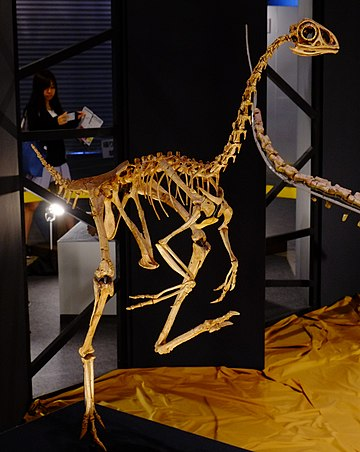
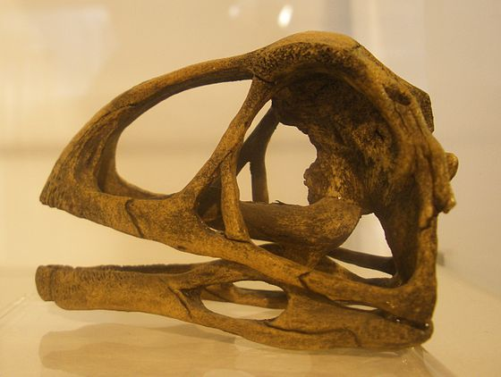

Der **Avimimus** wurde 1973 von einer sowjetisch-mongolischen Expeditionsgruppe in der Wüste Gobi entdeckt. Der Fund umfasste ein fast vollständiges Skelett. Kurz darauf wurde der **Avimimus** von Sergej Kursanow erstmals beschrieben. 1996 wurde ein weiteres, fast vollständiges Skelett gefunden. Durch einige isolierte Knochen konnte 2001 eine weitere Art, die **Avimimus Sp.**, beschrieben werden. 2008 wurde ein "*Bonebed*" gefunden. Ein Bonebed ist eine Sedimentschicht mit vielen fossilen Knochen. Die Sedimentschicht enthielt Überreste von mindestens 10 Exemplaren von **Avimimus Sp.**. Dieser Fund bestätigte, dass es zwei Avimimus-Arten gabt. Es warf auch die Theorie auf, dass der **Avimimus** in Gruppen lebte.

Der **Avimimus** besaß schlanke, lange Beine. Daraus schließt sich, dass er wahrscheinlich ein schneller Läufer war und eine hohe Geschwindigkeit erreichen konnte. Er hatte relativ kurze Arme, die er ähnlich wie bei Vögeln an den Körper anlegen konnte. Die flügelartigen Arme waren jedoch zu klein, um den Körper in der Luft tragen zu können. Da der **Avimimus** vermutlich nicht nur Pflanzen fraß, sondern auch Insekten, musste er wahrscheinlich manchmal in die Luft springen um an das ein oder andere Insekt zukommen. Da die Arme ähnlich wie die Flügel bei Vögeln waren und der **Avimimus** sie vermutlich zum Springen benötigte, besaß der **Avimimus** wahrscheinlich Federn. Der **Avimimus** hatte außerdem einen langen Hals und einen kleinen Schädel mit verhältnismäßig großen Augenhöhlen und viel Platz für ein großes Gehirn. Fast alle Knochen des Schädeldachs sind miteinander verbunden. Nur im vorderen Teil des Oberkiefers hatte der **Avimimus** kleine Zähne, der Rest war zahnlos.

Quellen:

* <https://dinonews.net/index/avimimus.php>
* <https://es.wikipedia.org/wiki/Avimimus>
