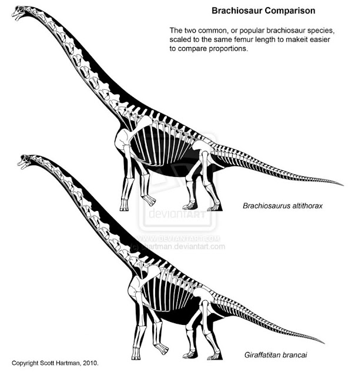
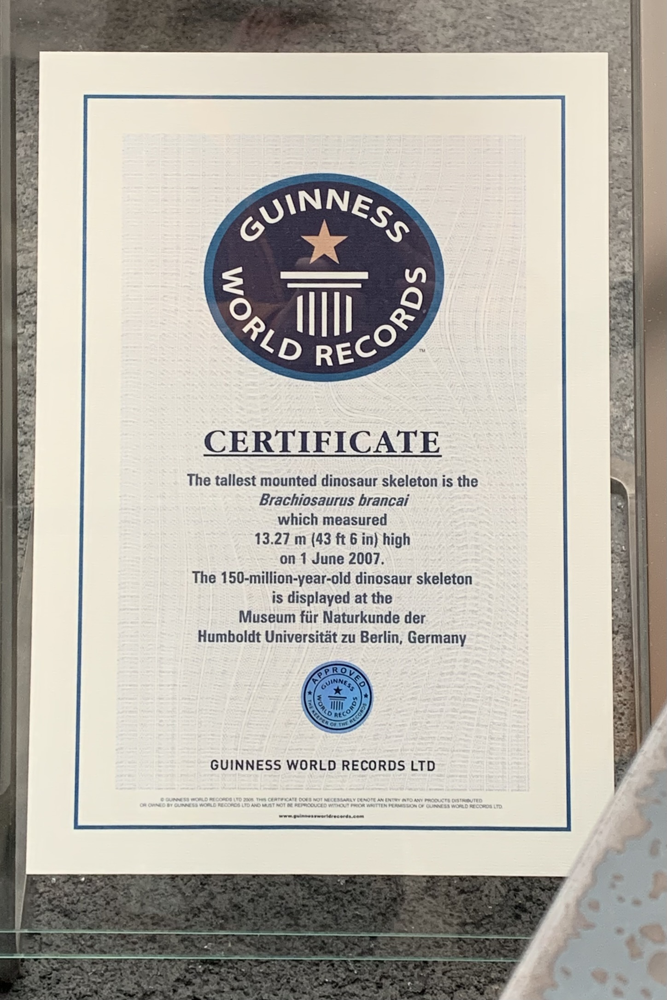
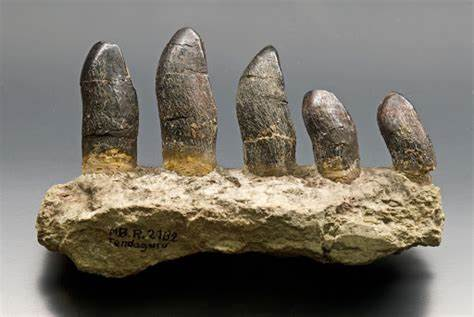
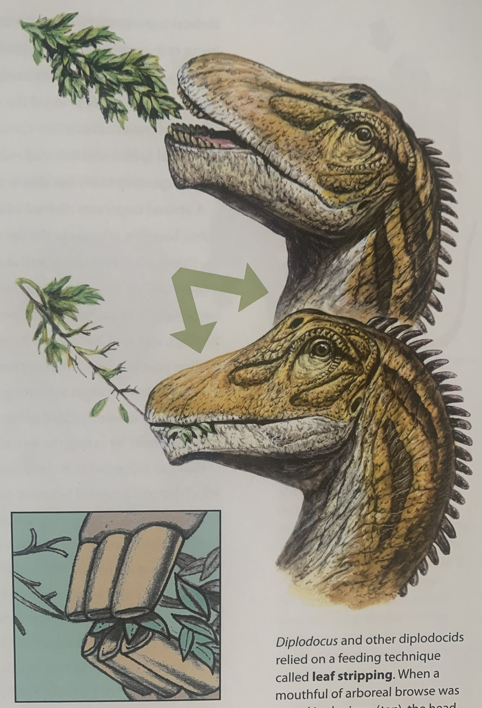
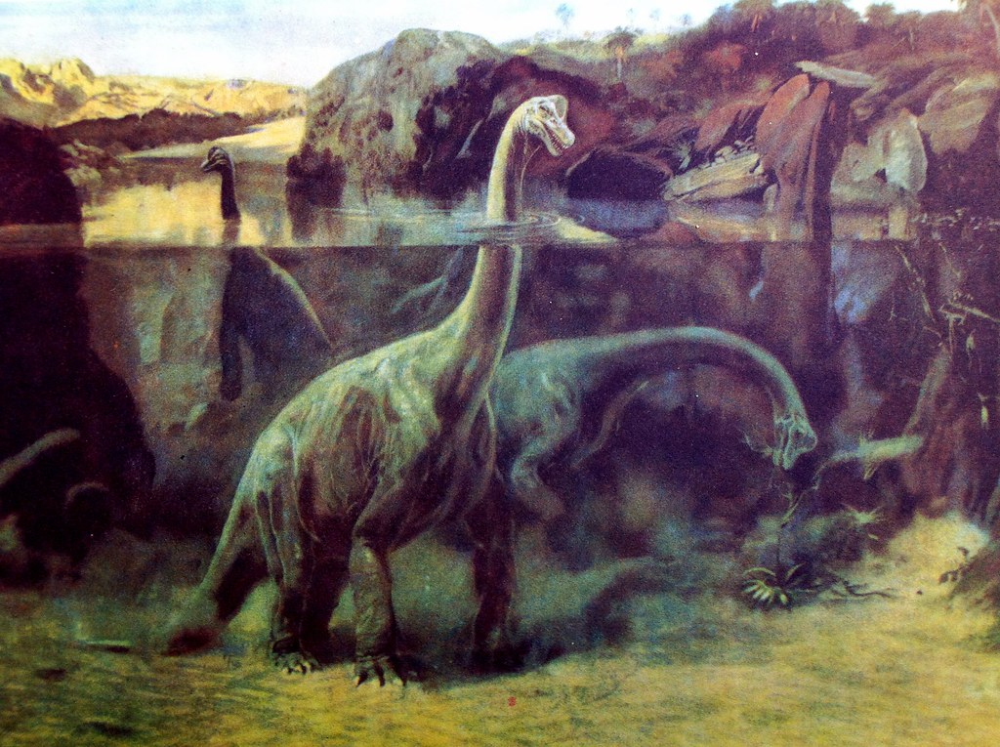

Der **Brachiosaurus** ist neben dem T-Rex einer der bekanntesten Dinosaurier der Welt und auch einer der Größten überhaupt. 

Der erste **Brachiosaurus** wurde 1900 von Elmer S. Riggs in Colorado, USA, entdeckt. 9 Jahre später starte eine Expedition im Tendagurugebiet, im heutigen Tansania. Der deutsche Paläontologe Werner Janensch fand während dieser Expedition ein weiteres Exemplar. Erst 2009, etwa 100 Jahre später, konnte ein britischer Paläontologe beweisen, dass der von Werner Janensch gefundene **Brachiosaurus** eigentlich der Art *Giraffatitan brancai* zugeordnet wird. Dem entsprechend sind die in den USA gefundenen Exemplare Brachiosaurier und die in Tansania gefunden wurden sind Giraffatitane. Der Name **Brachiosaurus** hat sich jedoch durchgesetzt, weshalb außerhalb des wissenschaftlichen Bereiches oft von einem **Brachiosaurus** die Rede ist, obwohl es vielleicht doch um einen Giraffatitan handelt.\
Der **Brachiosaurus** hat einen stabileren Körperbau als der Giraffatitan. Der Oberkörper und der Schwanz sind ebenfalls länger als bei Giraffatitan. Giraffatitan dagegen war deutlich schlanker und weist somit eindeutige Gemeinsamkeiten mit Giraffen auf. 

von Scott Hartman

Ein Skelett des Giraffatitans ist heute das größte ausgestellte Dinosaurierskelett. 2007 gewann das Museum für Naturkunde Berlin den Guinness World Records für das 13,27m hohe Skelett. 

Der mächtiger, mit Schuppen besetzte **Brachiosaurus** hatte eine Schulterhöhe von 12-15m. Allein der Oberarmknochen konnte schon 2m hoch sein. Der Hals des **Brachiosaurus** war etwa 9m hoch, insgesamt konnten Brachiosaurier bis zu 28m groß werden. Der **Brachiosaurus** hat, wie einige andere Dinosaurier auch, Hohlräume in den Knochen, ganz ähnlich wie bei Vögeln. Diese Hohlräume reduzierten sein Gewicht, trotzdem wog der **Brachiosaurus** etwa so viel wie 12 Elefanten. Aufgrund seiner Größe besaß der **Brachiosaurus** wahrscheinlich sehr starkes Herz.

Brachiosaurier wurden wahrscheinlich wegen ihrer Größe seltener angegriffen als andere Dinosaurier. Jedoch wird vermutet, das es Raubsaurier wie [Allosaurus](/dinos/allosaurus/) und Ceratosaurus auf die Jungtiere abgesehen hatten. Deshalb liefen die Jungtiere, wie auch Fußspuren beweisen, in der Mitte der Herde, umgeben von den großen Erwachsenen.

Kräftige Dinosaurier wie Brachiosaurier mussten auch sehr viel Fressen. Ein einzelner, ausgewachsener **Brachiosaurus** musste am Tag 200-400kg Nahrung zu sich nehmen. Dabei half ihm eine breite Schnauze, die viele Blätter gleichzeitig aufnehmen konnte. Der **Brachiosaurus** hatte insgesamt 52 Zähne, 26 pro Kiefer. Da der Brachiosaurier sich nicht nur von dünnen Blättern ernährte, sondern auch Nadeln von Nadelbäumen und anderes harrtes, faseriges Pflanzenmaterial fraß, mussten seine zapfenartigen Zähne einen rauen Zahnschmelz gehabt haben. Die zapfenartigen Zähne deuten ebenfalls darauf hin, das der **Brachiosaurus** die Blätter nicht abgebissen und zerkaut hat, sondern sie von den Bäumen gerupft und hintergeschluckt hat. Durch Magensteine wurde die Nahrung im Anschluss zerkleinert. 

Früher wurde irrtümlich vermutet, dass Brachiosaurier im Wasser lebten. Der lange Hals soll dabei aus dem Wasser herausgeragt haben.

Da die Brachiosaurier so riesig waren, gibt es viele Fragen wegen ihrem Sexualverhalten. Möglicherweise pflanzten sie sich im Wasser fort, da sie dort ihr Gleichgewicht besser halten konnten. Es gibt jedoch keine Bestätigung. Ebenfalls ist nicht bekannt, wie sie sich vor und nach dem Paarungsvorgang verhielten.
