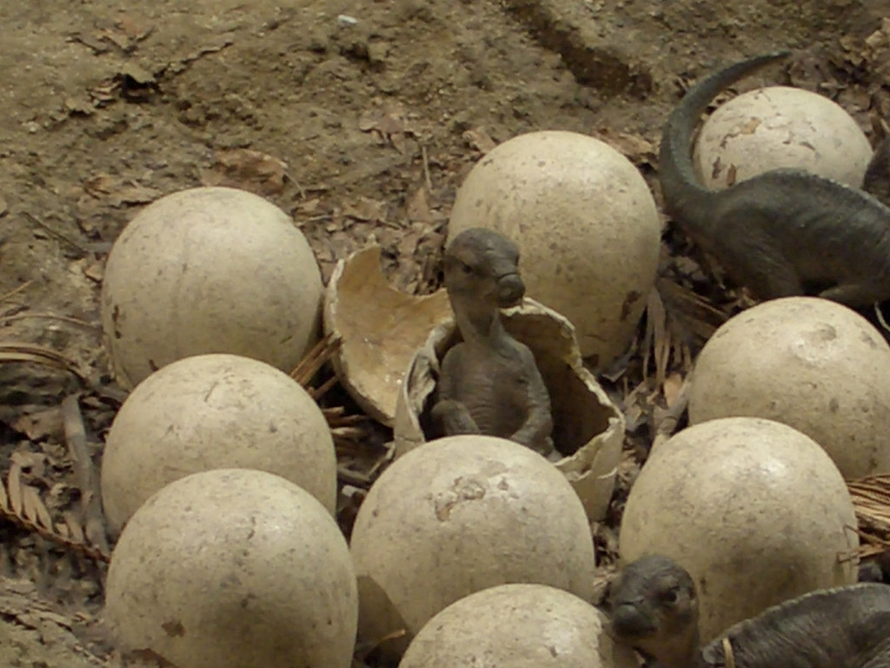
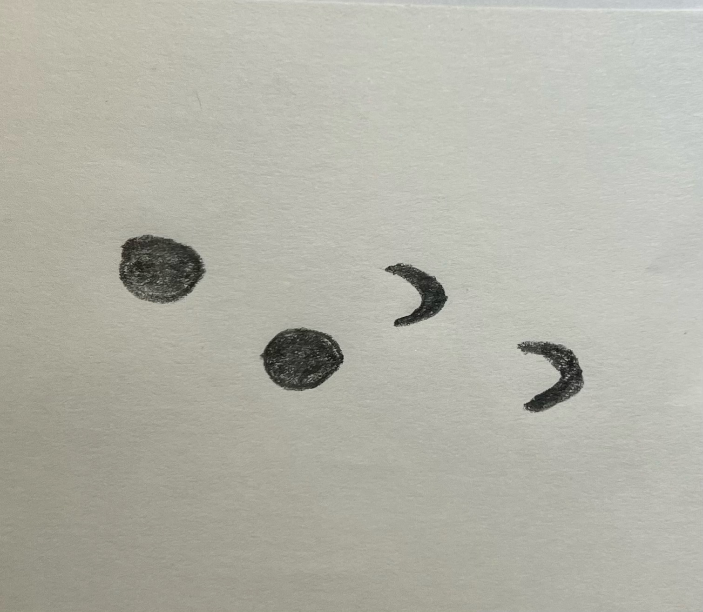

Der Brachiosaurus ist neben dem T-Rex einer der bekanntesten Dinosaurier. Er ist einer der größten Dinosaurier überhaupt. 

Der erste Brachiosaurus wurde 1900 von Elmer S. Riggs in Colorado, USA, entdeckt. 14 Jahre später fand der deutsche Paläontologe Werner Janensch ein weiteres Exemplar in Tansania. Erst 2009, etwa 100 Jahre später, konnte ein britischer Paläontologe beweisen, dass der 1914 gefundene Brachiosaurus eigentlich der Art Giraffatitan brancai zugeordnet wird. Dem entsprechend sind die in den USA gefundenen Exemplare Brachiosaurier und die in Tansania gefunden wurden sind Giraffatitane. Der Name Brachiosaurus hat sich durchgesetzt, weshalb auserhalb des wissenschaftlichen Bereiches oft von einem Brachiosaurus die Rede ist, obwohl es vielleicht doch um einen Giraffatitan handelt.  

hartes, faseriges pflanzenmaterial ->zapfenartige Zähne mit rauem zahnschnelz

* verscheißspuren auf zahnkronen-> nahrung etwas zerkaut
* wahrscheinlich sehr atarkes herz -> somstvohnmächtig
* da sehr groß viele fragen wegen sexualverhalten
* keine anhnung wie verhalten vor, nach, währen paarung
* möglicheweise vorpflanzung im wasser, besseres gleichgewicht
* Oberarmknochen etwas mehr als 2 meter -> proportionen ähnlich wie bei giraffen
* schwanz kürzer als bei anderen sauropoden, hing leicht inder luft
* etwas so schwer wie 12 afrikanische elefanten
* pflanzen von oben aber auch in niedrigeren bereichen
* brachte vielleicht höhere bäume zum fall um ran zu ommen
* große exemplare wurdeen wahrscheinlich nicht angegriffen, jungtiere schon allosaurus u. ceratsaurus
* jungtiere liefen laut spuren in der mitte der herde um von raubsauriern geschützt zu sein
* manche fachleute: bis 100 jahre alt
* breite schnauze -> viele blätter gleichzeitig
* füße ähnlich wie elefantenfüße
* schuppen
* leichter hals in knochen hohlräume, alle sauropoden haten dies, gutes gleichgewicht
* hals aus 1m langen wirbeln
* früher dachte man, er lebte im wasser
* starben wahrscheinlich, wenn in schlammigen teichgebieten stecken blirben
* weltrecord höchste ausgestellte dinoskelett giraffatitan in berlin oskar, 13 m, tansania
* 52 zähne 26 pro kiefer
* vielleicht durch großse nasenlöcher 
* schulterhöhe 12-15 m
* hals bis 9m
* 200-400 kg pflanzen pro tg
* herden

Der Name **Brachiosaurus** bedeutet "Armechse" und setzt sich aus den lateinischen Wörtern "bracchium" für Arm und "saurus" für "Echse" zusammen.

Der **Brachiosaurus** hatte einen sehr langen Hals, aber doch war er etwas zu klein, um an die Spitze der großen Nadelbäume heran zukommen. Deshalb stellte er sich beim Fressen auf seine Hinterbeinen.

Es ist davon auszugehen das der **Brachiosaurus** sehr starke Hinterbeine hatte. Er hatte zwar starke Hinterbeine, aber trotzdem waren sie ein bisschen kleiner als die Vorderbeine.

Am Tag verschlag ein **Brachiosaurus** ca. 200kg Blätter und Zweige. Er hatte Zähne die in Form eines Löffels waren, damit er die Pflanzen besser zermahlen konnte.

Der **Brachiosaurus** hatte Krallen an den Hinterbeinen mit denen er wahrscheinlich Löscher für Nester grub. Darin legte er seine Eier ab.

Man hat Fußspuren gefunden, bei denen man erkennen konnte das die Abdrücke der Vorderbeine ähnlich wie bei Pferden waren und die Abdrücke der Hinterbeine waren mehr wie ein Kreis.

Quellen:

* <https://www.deviantart.com>
* <https://flickr.com/photos/currybet/35591652>
