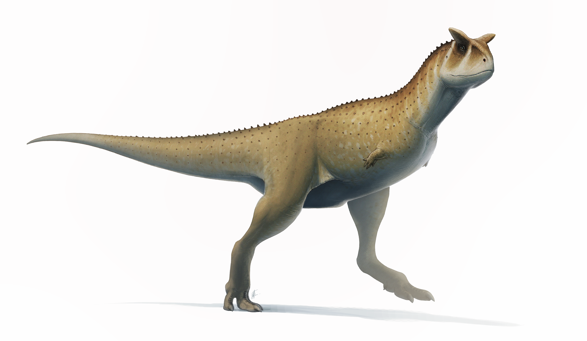
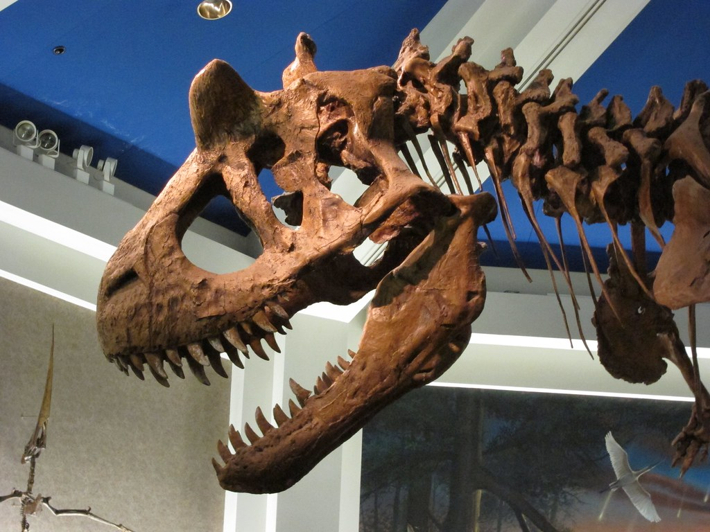

Der Carnotaurus bist für seine stumpfen Hörner über seinen Augen und seine sehr kurzen Arme bekannt. Er wurde 1985 von Ángel Sastre, einen Großgrundbesitzer, in der La-Colonia-Formation in Chubut entdeckt. José F. Bonaparte präparierte und rekonstruierte das Skelett zusammen mit seinem Team. Das in Argentinien gefundene Skelett ist bisher das einzige Exemplar eines Carnotaurus. \
Der Carnotaurus fiel wahrscheinlich nach seinem Tod in eine Schlammgrube, wodurch die Knochen gut konserviert wurden. Das Skelett wurde in der typischen *death pose* gefunden, das heißt, das Skelett lag auf der rechten Seite, der Hals über dem Rücken gekrümmt. Trotz des guten Zustands fehlen Teile des Skeletts, die Beine und der Schwanz. Durch die Konservierung blieben auch Hautabdrücke erhalten, die Zeigten, dass die Körperflanken des Carnotaurus mit kegelförmigen Stacheln versehen waren. Die Hautabdrücke zeigen auch, dass Carnotaurus mit napfförmigen Schuppen ausgestattet war, die wahrscheinlich zur Wärmeregulierung dienten.

Die kurzen Arme des Carnotaurus hatten wahrscheinlich keine bedeutende Funktion. Sie sind klein um Beute festzuhalten oder ähnliches. Möglicherweise wurden sie jedoch zur Balz eingesetzt. \
Experten vermuteten, das die Arme sich mit der Zeit zurückgebildet haben und ihre Funktion verloren haben. Die Arme hatten vier Finger, die miteinander verwachsen waren, so dass sie nicht einzeln bewegt werden konnten. An den Fingern befanden sich, untypisch für Theropoden, keine Krallen. Carnotaurus besaß freie Schultergelenke, weshalb er seine Arme vermutlich besser bewegen konnte als alle anderen Theropoden.

Der Schädel des Carnotaurus ist im vergleich zu anderen Theropoden sehr klein. Er ist kurz und hat einen schmalen, flachen Unterkiefern. Das in Argentinien gefundene Exemplar beinhaltet ein fast vollständigen Schädel, der Bereich um die Augenhöhlen ist leicht nach vorn gedreht, was auf ein räumliches Sehvermögen hindeutet. \
Das markanteste Merkmal des Carnotaurus sind jedoch die Hörner über seinen Augen. Bis heute ist nicht geklärt, wozu die stumpfen Hörner genutzt wurden. Wahrscheinlich wurden sie zur Balz oder zum abwehren von Rivalen genutzt.

1985 entdeckt ( gut erhaltenes Teilskelett)

kurze, vermutlich nutzlose Arme mit 4 Fingern 

gut erhaltene Hautabdrücke -> Körperflanken mit kugelförmigen Stacheln 

* stumpfe Hörner über den Augen -> deshalb Stier😈

Hörner zur Balz oder Rivalen vetreiben😈

kurzer Schädel

Füße unbekannt 

flacher schmaler Unterkiefer

freie Schultergelenke, konnte vermutlich besser bewegen als andere Theropoden

arme möglicherweise auch für Balz

bekannt für stumpfe Hörner über augen

Tod in Schlammgrube -> gute konservierung der Knochen

typische Death pose 

* einer der best erforschten theropoden der südlichen Hemisphäre

1 exemplar

keine krallen

finger verschmolzen -> konnten nicht einzeln bewegt werden

napfförmige schuppen

vier Finger

äugen nach vorn gerichtet räumliches Sehvermögen 🐨

Arme haben sich möglicherweise mit der Zeit zurück gebildet

La-Colonia-Formation in Chubut

Schädel fast vollständig erhaltemn🐨

schuppen zur wärmeregulierung

