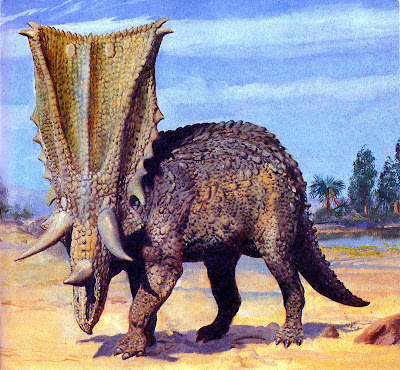
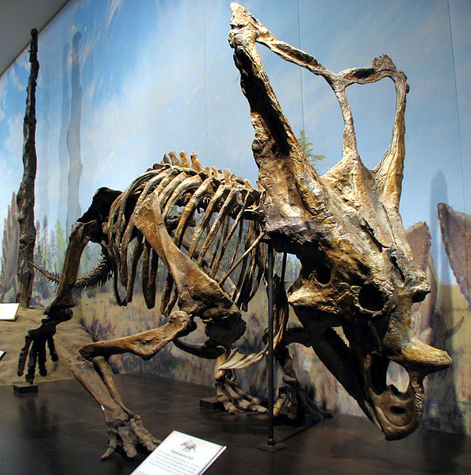

Der **Chasmosaurus** war ein relativ langsames Herdentier, aber durch sein gigantisches Nackenschild größer und bedeutsamer wirkte. Der Name Chasmosaurus bedeutet "*Lochechse*" und bezieht sich auf die zwei großen Löcher in seinem Nackenschild. Trotzdem wird er meistens ohne dargestellt. Das Schild diente vermutlich dazu, den Hals und die Schultern vor Angriffen zu schützen oder aber auch um Feinde abzuschrecken und Weibchen anzulocken.

1902 fand Lawrence Lambe in Alberta drei Ceratopsier - Monoclonius dawsoni, Monoclonius canadensis und Monoclonius belli. Alle ordnete er der Monoclonius-Familie zu. Später stellte er jedoch fest, dass keiner der Ceratopsier dieser Familie angehörten. Einer dieser Dinosaurier wurde als Centrosaurus, der zweite als Eoceratops (jetzt Mojoceratops) identifiziert. Der Dritte wurde von Lawrence Lambe in *Protorosaurus* umbenannt. Jedoch fand Lawrence Lambe 1914 heraus, dass ein Reptil aus dem Perm bereits diesen Namen trägt. Deshalb wurde *Protorosaurus* kurzerhand in **Chasmosaurus** geändert.  

Der Forscher C. M. Sternberg untersuchte im Nationalmuseum Kanadas zwei **Chasmosaurus**-Skelette, dabei stellte er fest, dass eines größer und kräftiger gebaut ist. Er vermutete das es sich hierbei um ein weibliches und ein männliches Exemplar handeln könnte.

