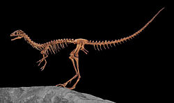

Der **Compsognathus** war ein kleiner Räuber. Er war etwa so groß wie ein Huhn und hatte einen Schwanz, der ein bisschen länger war, als das doppelte seiner Körpergröße.

Vermutlich hielt er sich in der Nähe von größeren Dinosauriern, wie zum Beispiel dem [Stegosaurus](https://dino-fakten.de/dinos/stegosaurus/)auf. Wahrscheinlich zu seinem Schutz. Dennoch war dass für die kleinen Raubdinosaurier nicht ungefährlich, denn sie mussten aufpassen, dass sie nicht zertrampelt wurden.

Der erste **Compsognatus** wurde von Joseph Oberndorfner gefunden. Doch man weiß nicht genau wo und wann, denn der Fund wurde geheim gehalten, bis ihn der deutsche Zoologe Johann Andreas Wagner erstmals beschrieb.

Quellen:

* <https://www.flickr.com/photos/paleopeter/15502230393/>
* [https://en.wikipedia.org/wiki/Compsognathus](ttps://en.wikipedia.org/wiki/Compsognathus)
