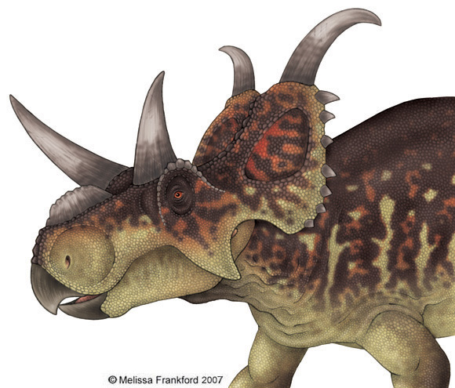

Der **Diabloceratops** hat zwei sehr große Hörner auf seinem Nackenschild, daher bekam er auch den Namen "*Gesicht mit Teufelshörner*" Wie bei dem Triceratops hat der **Diabloceratops** drei etwas kleinere Hörner im Gesicht.

Der **Diabloceratops** wurde am 16. Juli 1998 von Geologe Joshua A. Smith entdeckt.

Quellen:

* <https://tcatmon.com/wiki/%EB%94%94%EC%95%84%EB%B8%94%EB%A1%9C%EC%BC%80%EB%9D%BC%ED%86%B1%EC%8A%A4>
* <https://www.deviantart.com/mmfrankford/art/Wahweap-Ceratopsian-93929607>
