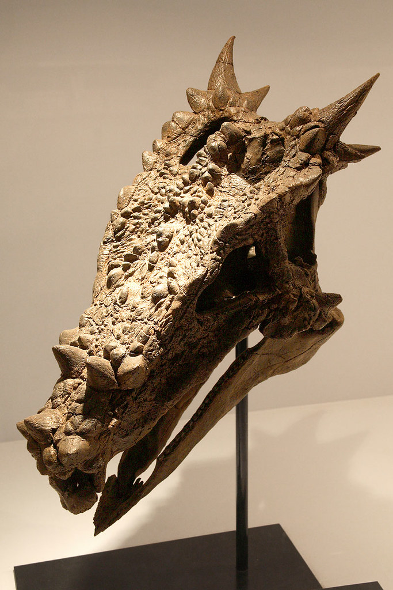
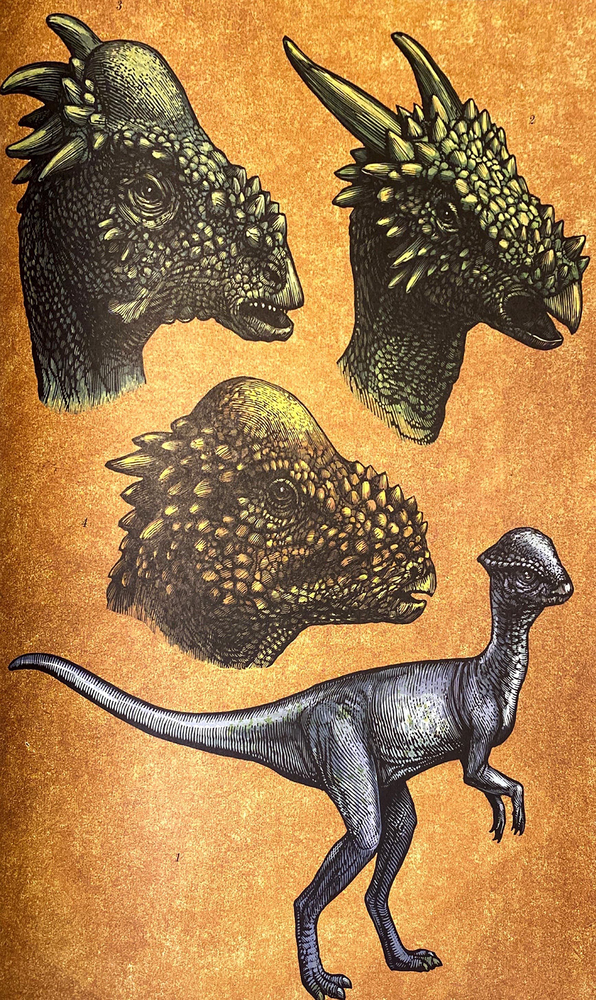

**Dracorex** war ein mittelgroßer Herbivore, der vor etwa 66 Millionen Jahren in Nordamerika lebte. Er wurde erstmals von den drei Fossilensammlern Brian Buckmeier und den Brüdern Steve und Pat Saulsbury in der Hell-Creek-Formation im US-Bundesstaat South Dakota entdeckt. Die drei Hobbypaläontologen entschieden, die Fossilien an das Children’s Museum of Indianapolis zu stiften. Der Schädel wurde noch vor der Benennung ausgestellt. Viele der Besucher glaubten einen Drachen vor sich zu haben, was Robert T. Bakker bei der Untersuchung ebenfalls berücksichtigte. Er entschied sich, zu Ehren der Schriftstellerin Joanne K. Rowling, für das nachgestellte Art-Epitheton „hogwartsia“ als eine Hommage an die Drachen in den Harry Potter-Romanen.

**Dracorex** wurde zur der Gruppe Pachycephalosauride zugeordnet. Doch seit der Entdeckung des Dinosauriers gibt es Theorien, die besagen des es sich nicht um einen neuen Dinosaurier handelt, sondern um eine jugendliche Form der Parycephalosaurus. In der Theorie verändert sich der Schädel in den einzelnen Lebensabschnitten, sodass sich die Höcker und Stacheln im Laufe seiner Entwicklung zu einem ausgewachsenen Exemplar, zu einer kugelförmigen Wölbung verwachsen.

Wenn man die Schädelform von Stegoceras (1), **Dracorex** (2), Stygimoloch (3) und [Parycephalosaurus](/dinos/pachycephalosaurus/) (4) miteinander vergleicht, kann man Gemeinsamkeiten feststellen. Bei Stegoceras, Stygimoloch und [Parycephalosaurus](/dinos/pachycephalosaurus/) ist eine Gemeinsamkeit die Wölbung über den Augen. Wenn man sich die Schädel von **Dracorex**, Stygimoloch und Parycephalosaurus ansieht, erkennt man bei allen drei Dinosauriern eine unterschiedliche Form des Schädels. Alle drei haben sie kleine Stacheln, die sich über ihren ganzen Kopf verteilen. Noch konnte die Funktion der Kopfstacheln nicht geklärt werden. Wahrscheinlich waren sie zur Verteidigung gut oder zum Anlocken von Weibchen.

Quellen:

* <https://spinops.blogspot.com/2012/06/dracorex-hogwartsia.html>
* <https://www.flickr.com/photos/kabacchi/4776184268/>
