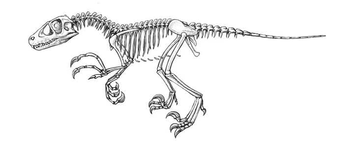

Der **Dromaeosaurus** hat wahrscheinlich in Waldländern und Ebenen seine Beute gejagt, vermutlich hat er sich wie eine Katze angeschlichen. Er war ungefähr so groß wie der **Velociraptor**, konnte aber vermutlich stärker zubeißen.  

Es wurde nur ein Teil des Schädels einige Knochen gefunden. Das Skelett wurde nach dem Vorbild verwandter **Dromaeosaurier** rekonstruiert.  

Quellen:

* <http://www.dinodana.com>
* <https://dinosaurierwelt.com>
