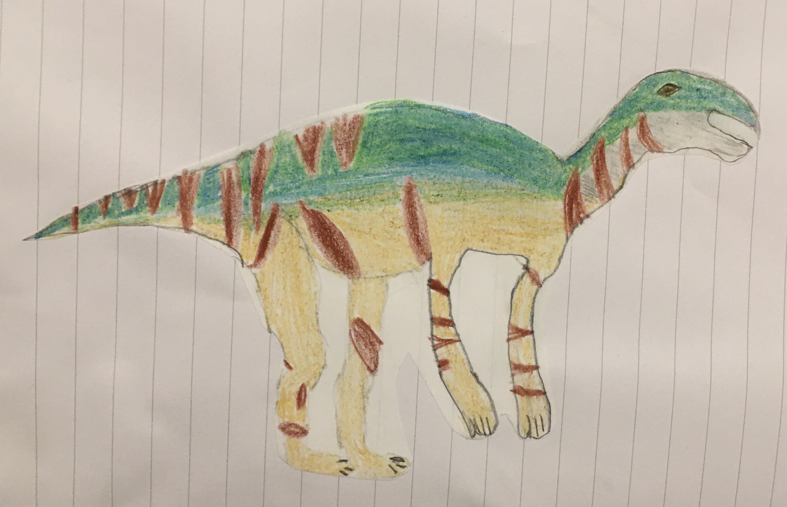
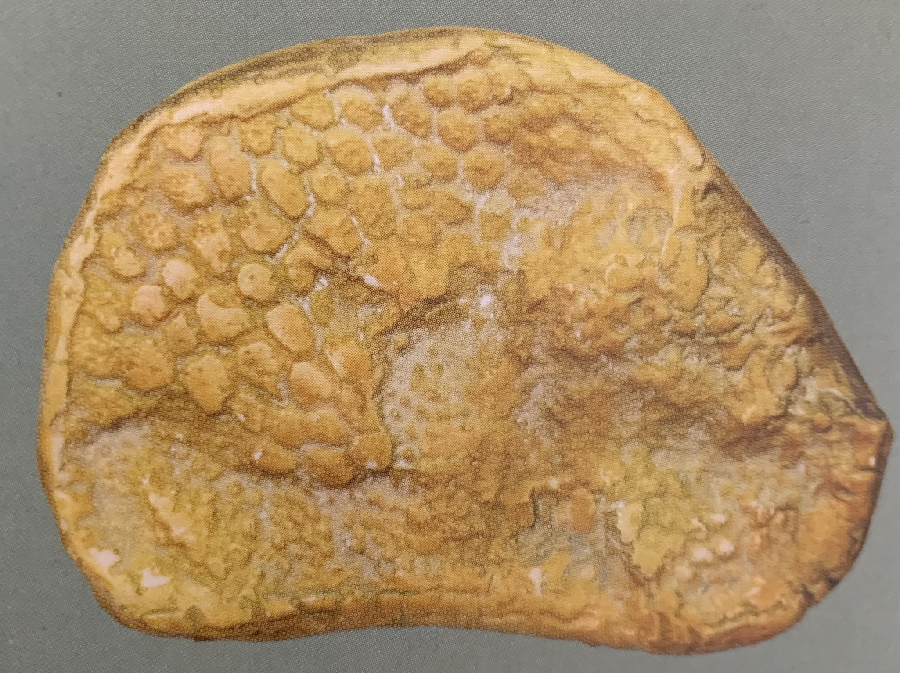
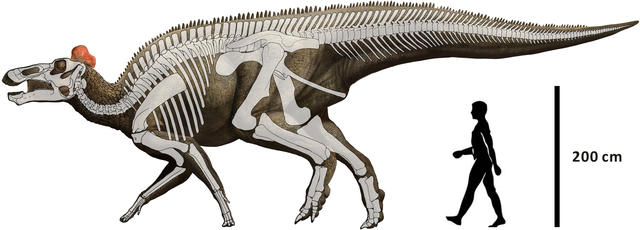

Der **Edmontosaurus** ist einer der größten seiner Art. Er wurde bis zu 12-13m lang und 3,5m hoch. Der **Edmontosaus** lief auf allen Vieren. Zum Fressen konnte er sich zu tiefen Pflanzen hinunter beugen. Er stellt sich nur auf die Hinterbeine wenn es notwendig war zum Beispiel: um an höhere Büche oder Bäume zu gelangen. Auch wenn er auf der Flucht war und schnell verschwinden musste, rannte er nur mit den Hinterbeinen.

Vom **Edmontosaurus** sind Fossilmumien bekannt. Das bedeutet, dass die Weichteile des toten Dinosauriers vor dem Verwesen getrocknet sind und dann von Sand verschüttet wurden. Nach einiger Zeit ist das Skelett dann versteinert. Dadurch kann man auch versteinerte Abdrücke, zum Beispiel von der Haut, finden. Durch die Abdrücke der Haut, weiß man das sie große Knoten hatte.

Der **Edmontosaurus** hatte ein ähnliches Maul wie bei einer Ente, also einen Schnabel. Die vordere Hälfte des Schnabels war zahnlos, also saßen die Zähne hinten im Kiefer. In manchen Schädeln findet man bis zu 1600 Zähne. Der **Edmontosaurus** hatte große Nasenöffnungen, vielleicht befanden sich dahinter Luftsäcke, die er wie einen Luftballon aufblasen und damit Geräusche machen konnte. Vielleicht konnte der **Edmontosaurus** das auch mit seinem fleischigen Kamm machen.

Quellen:

* <https://commons.wikimedia.org/wiki/File:Edmontosaurus_regalis.PNG>
* <https://www.deviantart.com/curaeus/art/Edmontosaurus-Regalis-771880648>
* Dinosaurier und andere Tiere der Urzeit, Verlag: Dorling Kindersley
