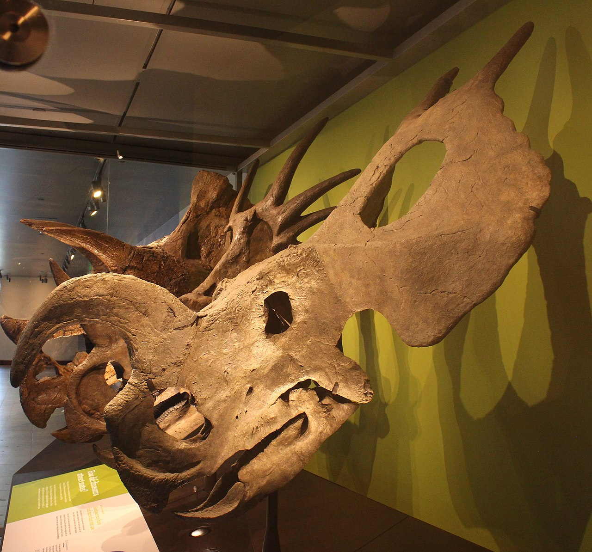

Der **Einiosaurus** war ein pflanzenfressender Ceratopsier aus der Familie der Ceratopsidae. Das erste Exemplar wurde 1985 von Jack Horner in Montana gefunden. Die Ausgrabung dauerte mehrere Jahre und es wurde eine komplette, kleine Herde von mindestens 15 Individuen entdeckt. Erst 1994 wurde der Name **Einiosaurus procurvicornis** erstmalig vom kanadischen Paläontologen Scott Donald Sampson auf der jährlichen Society of Vertebrate Paleontology Konferenz verwendet.

Das Hauptmerkmal eines **Einiosaurus** ist das nach vorn gebogene Nasenhorn auf dem Schädel, zusammen mit dem mächtigen Nackenschild. An der Fundstelle wurden verschieden große Nasenhörner gefunden, so das man annimmt, dass das Nasenhorn mit gewachsen ist. Bei jungen Tieren war es gerade, die Krümmung nach vorn gab es nur bei erwachsenen Tieren. Nicht jeder **Einiosaurus** besaßen ein Nashorn.

Das nach vorne gebogene Nasenhorn, zusammen mit den nach hinten ragenden kleinen Hörnern am Schild, dürfe hauptsächlich als Schmuck, Drohung und zur Erkennung einzelner Arten gewesen sein. Für die Verteidigung war es nicht sehr gut geeignet. Das Schild bot kaum Schutz vor Bissen. **Einiosaurus** hatte kurze Beine und hufähnliche Füße.

Der **Einiosaurus** war ein Pflanzenfresser. Mit der spitzen Schnauze konnten sie gezielt Nahrung aufnehmen. Diese bestand vermutlich hauptsächlich aus harten, faserigen Pflanzen die sie mit ihren schneidenden Zähnen zerkleinern konnten. Bei einzelnen Funden wurden über 100 Zähne entdeckt.

Quellen:

* <https://en.wikipedia.org/wiki/Einiosaurus>
* <https://en.wikipedia.org/wiki/Society_of_Vertebrate_Paleontology>
