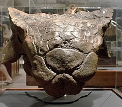
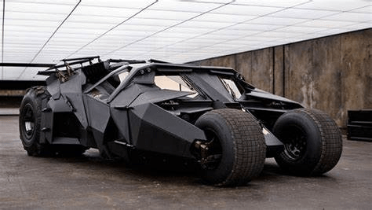

Der **Euoplocephalus** hatte ein Keule am Ende seines Schwanzes, mit der er sich gegen Angreifer gewehrt hat. Er war in den Waldländern unterwegs. Der **Euoplocephalus** hatte einen Schädel, der mit einem Mosaik aus kleinen Platten bedeckt war.

Auch in den Augenlidern befanden sich Knochenplatten, die die Augen schützten. Der **Euoplocephalus** war sozusagen das "*Batmobil*" unter den Dinosauriern.

 Auch der **Euoplocephalus** war kräftig, niedrig und mit schweren Platten bedeckt. Der Euoplocephalus war insgesamt sehr gut geschützt, doch sein weicher Bauch war nicht gepanzert.

Quelle:

* <https://www.deviantart.com>
