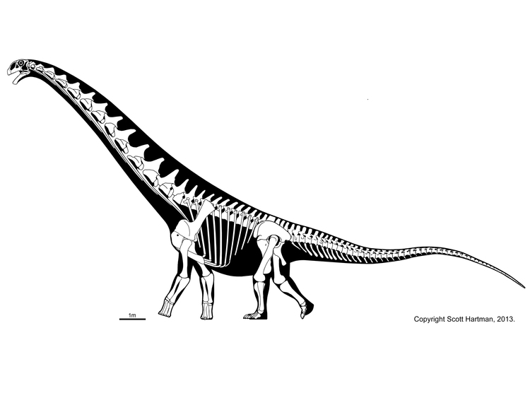
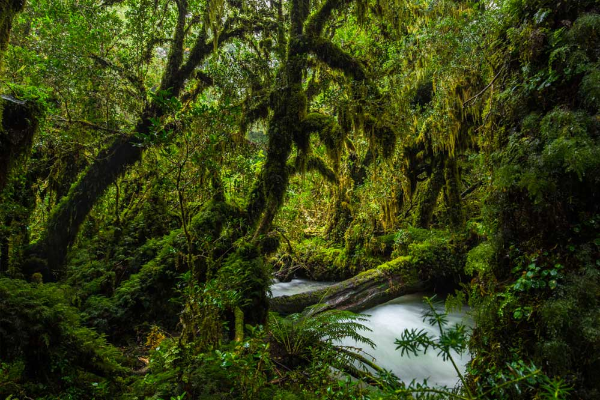

Der **Futalognkosaurus** war einer der drei größten Dinosaurier die je auf unserem Planeten gelebt haben.

 Er lebte vor ca. 88 Millionen Jahren in Patagonien, im heutigem Südamerika in tropischen Wäldern.  

Quelle:

* <https://www.deviantart.com/spinoinwonderland/art/Futalognkosaurus-dukei-750450335>
* <https://www.skeletaldrawing.com/home/sauropod-gallery-overhauled>
* <https://alleideen.com/tipps-fur-weltreisen/>
