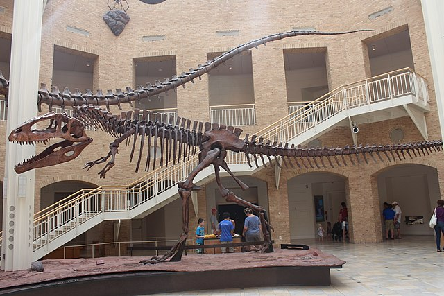
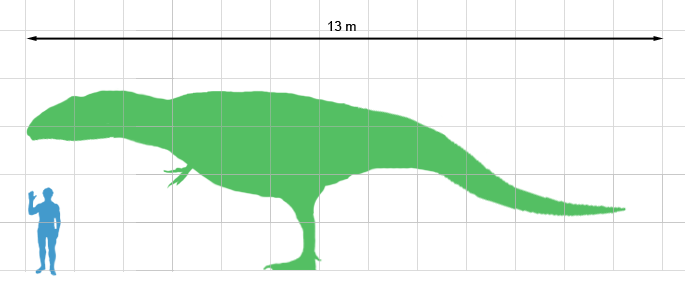

Der **Giganotosaurus** war ein starker Räuber der vermutlich in Waldländern Sauropoden gejagt hat. Er ist so schwer wie 125 Menschen.

Im Vergleich mit einem Menschen ist der **Giganotosaurus** riesig.

Quellen:

* <https://www.deviantart.com>
* <https://commons.wikimedia.org>
* <https://de.wikipedia.org>
