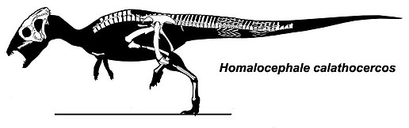

Der **Homalocephale** gehört mit seinen 3 Metern, zu den mittleren Dinosauriern der Gruppe der Pachycephalosauria. Er hat einen flachen, keilförmigen und verdickten Schädel. Der **Homalocephale** hat nur an den Seiten Zähne. Am Oberkiefer haben die Zähne dreieckige Kronen, durch diese Mahlzähne vermutete man, dass er Pflanzen fraß, vielleicht auch manchmal ein paar Insekten.

Der **Homalocephale** hat in seiner Gruppe das Skelett mit den meist entdeckten Knochen. Anders als bei anderen Pachycaphalosauriern, ist das Rumpfskelett gut erhalten geblieben. Der **Homalocephale** hatte ein stabilen Rumpf. Die Rückenwirbel waren durch Verbindungen verstärkt.

Quellen:

* <https://cs.wikipedia.org/wiki/Homalocephale>
* [https://uk.wikipedia.org/wiki/](https://uk.wikipedia.org/wiki/%D0%93%D0%BE%D0%BC%D0%B0%D0%BB%D0%BE%D1%86%D0%B5%D1%84%D0%B0%D0%BB)
