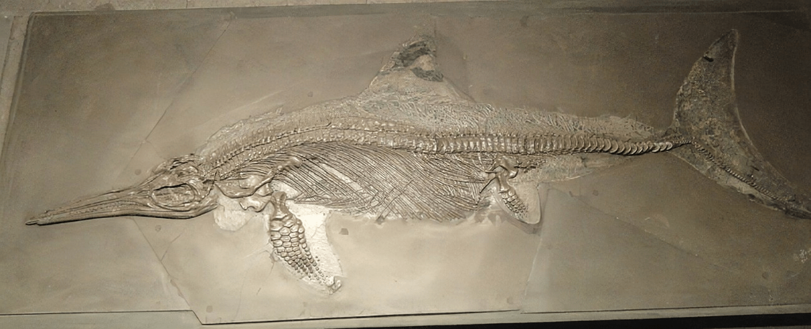

Der **Ichthyosaurus** lebte im Wasser und war kein Dinosaurier sondern ein Meeresreptil. Er konnte sich aufgrund seiner Flossen nicht an Land bewegen. Er musste zum Atmen auftauchen um Luft zu holen. Der **Ichthyosaurus** ist mit den Delfinen verwand und hatte noch viele andere Nachkommen. Der **Ichthyosaurus** hatte gute Ohren und super Augen, mit denen er trotz des trüben, dunklen Wassers sehr scharf sehen konnte. Seine Leibspeisen waren Fische und Tintenfische, die er mit seinem guten Gehör aufspürte.

Am 11. Januar 2022 wurde in der Tageszeitung [zeit.de](https://www.zeit.de/wissen/umwelt/2022-01/ichthyosaurier-fossil-grossbritannien-fund-palaeontologie) ein Beitrag über einen weiteren **Ichthyosaurus**, der in Großbritannien entdeckt wurde, veröffentlicht.

Quellen:

* <https://theconversation.com/how-we-found-scotlands-first-jurassic-sea-reptile-and-no-shes-not-related-to-nessie-36165>
* <https://scienceforthekids.wordpress.com/2013/03/11/what-is-an-ichthyosaur/>
