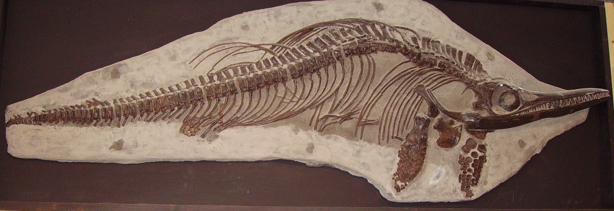

**Ichthyosaurus** *communis*, ein prähistorisches Tier, welches dem heutigen Delfin sehr ähnelte. Er ist KEIN Dinosaurier, lebte ebenfalls im Jura vor 201-190 Millionen Jahren. Somit lebten Dinosaurier und der **Ichthyosaurus** zur selben Zeit.\
Der **Ichthyosaurus** *communis* hatte wie auch andere Ichtyosaururia eine stromlinienförmige Körperform, was das Schwimmen in den Meeren vereinfachte. Um schnell voran kommen zu können schlug er seine Schwanzflosse immer wieder hin und her. Seine paddelförmigen Vorderflossen nutze er zum Lenken. 

Ichthyosauria war die erste Reptiliengruppe die vollständig im Wasser lebte. Sie besaßen jedoch keine Kiemen, weshalb sie immer wieder an die Wasseroberfläche auftauchen mussten. Ichthyosauria hatten eine lange Schnauze, die mit vielen Zähnen ausgestattet war. In den Koprolithen (Exkrementen) einiger Exemplare, fand man Überreste von Fischen und Tintenfischen. Mit einer soliden Knochenstruktur des Trommelfells konnten die Ichthyosaurier womöglich die Vibrationen spüren, die ihre Beute im Wasser erzeugten. Diese Fähigkeit machte sie wahrscheinlich zu exzellenten Jägern.\
Ein für Ichthyosauria typisches Merkmal waren die großen Knochenringe um ihre Augen. Diese werden Sclerotische Ringe genannt. Sie stabilisierten die Augen der Ichthyosaurier, damit diese sich nicht verformen oder eingedrückt werden. Die Knochringe zeigen wie groß die Augen tatsächlich gewesen waren. Der Ophthalmosaurus hatte von allen Ichthyosauria die größten Augen mit einem Durchmesser von bis zu 20 cm. Ichtyosauria hatten unter allen uns bekannten Wirbeltieren die größten Augen.

Wenn von Ichthyosauria die Rede ist, handelt sich nicht um eine spezifische Art, sondern um rund 100 verschiedene. Je nach Art konnten die Ichtyosausia bis zu 20 m lang und bis zu 50 t schwer werden. Diese beindruckenden Wesen bevölkerten die Meere vor 251-93 Millionen Jahren.

Die zehn bekanntesten Ichthyosauria:

1. **Ichthyosaurus** *communis*
2. Stenopterygius quadriscissus
3. Ophthalmosaurus icenicus
4. Temnodontosaurus platyodon
5. Excalibosaurus costini
6. Leptonectes tenuirostris
7. Mixosaurus cornalianus
8. Shonisaurus popularis
9. Besanosaurus leptorhynchus
10. Platypterygius australis

Der größte bekannte Ichthyosauria war der Shastasaurus sikanniensis. Der in Kanada entdeckte Riese wurde bis zu 21 m lang. Dieser gigantische Meeresbewohner hatte vermutlich keine Zähne und ernährte sich wahrscheinlich wie die heutigen Bartwale.

Der kleinste bekannte Ichthyosaurier war der Cartorhynchus lenticarpus. Der im frühen Trias lebende Ichthyosauria war nur 40 cm groß und wies noch Amphibien-ähnliche Merkmale auf.

Ichthyosaurier legten keine Eier, sie gebaren lebend. Im Inneren einiger erwachsener Exemplare wurden winzige Knochen von Ichthyosauriern gefunden, die eine lebende Geburt beweisen. Die Jungtiere schlüpften wahrscheinlich zuerst mit dem Schwanz zuerst aus dem Körper der Mutter, damit sie nicht sofort ertranken.

Der erste **Ichthyosaurus** wurde von Mary Anning gefunden. 1811 entdeckte ihr Bruder Joe einen Schädel eines **Ichthyosaurus** zwischen den Felsen der Klippen von Lyme Regis in England. Zusammen legten die erst 12 Jahre alte Mary und der 15 jährige Joe das restliche Skelett frei. Zuerst wurde vermutet, dass es sich um ein Krokodil handelt. Der Naturforscher Charles König klassifizierte das Skelett neu und gab ihm den Namen **Ichthyosaurus**. Später fand Mary Anning noch weitere **Ichthyosaurus**-Fossilien. Durch die vielen Funde von **Ichthyosaurus** ist dieser einer der best-erforschtesten prähistorischen Tiere.

