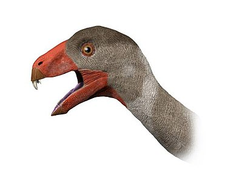

Der **Incisivosaurus** erinnerte an einen Hasen. Er hatte einen 10cm langen Kopf und zwei große Schneidezähne vorne am Oberkiefer, wegen der Zähne bekam er auch seinen Namen "*Schneidezahn-Echse*". Bekannt ist der **Incisivosaurus** durch seinen fast vollständigen Schädel und seiner zum Teil erhaltenen Halswirbel.

Quellen:

* <http://blogevolved.blogspot.com>
* <https://nl.wikipedia.org>
