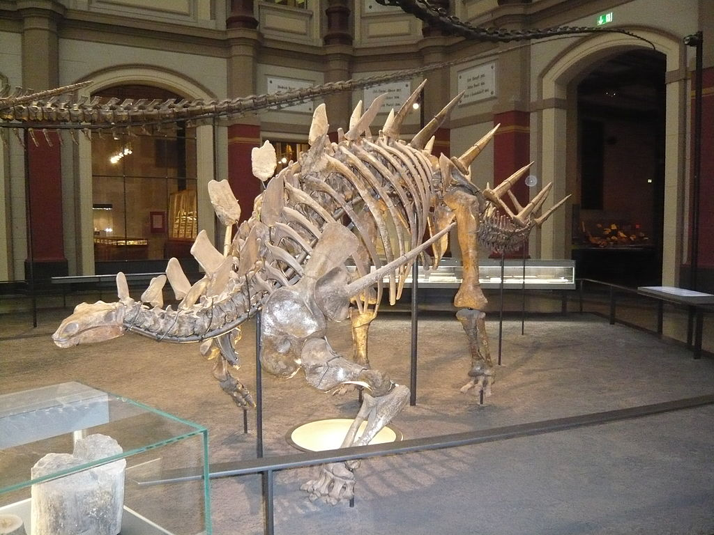

Der **Kentrosaurus** hatte vom Kopf bis Mitte Rücken Knochenplatten und nach den Knochenplatten kamen Stacheln die sich bis zum Ende seines Schwanzes  zogen. Einen weiteren Stachel hatte er auch, oberhalb seiner Vorderbeine auf jeder Seite.

Einige Wissenschaftler glauben, das der **Kentrosaurus** zwei Gehirne hatte. Vermutlich hatte er ein kleines im Kopf und ein größeres am Rumpf. Andere Forscher glauben, dass das Gehirn am Rumpf eine Fettreserve war.

Quellen:

* <https://www.deviantart.com/ntamura/art/Kentrosaurus-196352320>
* <https://de.wikipedia.org/wiki/Datei:Kentrosaurus_IB.jpg>
