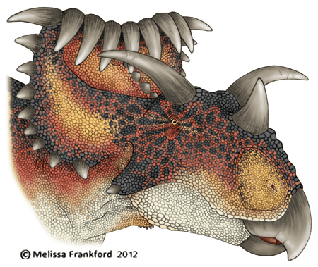

Der **Kosmoceratops** ist mit dem [Triceratops](/dinos/triceratops/)verwand. Seinen Namen "*geschmücktes Horngesicht*" bekam er durch die vielen Hörner auf dem Kopf.

Die Hörner sind sozusagen der Schmuck, sie dienten vermutlich nicht nur zur Verteidigung sondern auch in der Paarungszeit zur Anlockung von Weibchen.  

Quellen:

* <https://nl.wikipedia.org>
* <https://www.deviantart.com>
