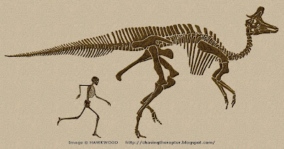

Von dem **Lambeosaurus** sind 20 gut erhaltene Schädel und auch ein paar Skelette bekannt. Viele Schädel hatten einen unterschiedlichen Kamm. Sie wurden trotzdem dem **Lambeosaurus** *lambei* zugeordnet und die Vermutung aufgestellt, dass es verschiedene Altersstufen dieses Dinosauriers waren.

Der **Lambeosaurus** lief, wie viele andere Hardrosaurier, auf allen Vieren. Er konnte sich aber auch nur auf seinen beiden Hinterbeinen fortbewegen. Diese Gangart nennt man *quardruped*.

Der **Lambeosaurus** hat viele Verwandte. Am ähnlichsten ist er dem [Corytosaurus](/dinos/corythosaurus/)und dem [Parasaurolophus](/dinos/parasuarolophus/).

Quellen:

* <https://rimasdecolores.blogspot.com/2012/06/dinosaurios-tipos-de-dinosaurios.html>
* <https://chasingtheraptor.blogspot.com/2010/02/hoots-honks-and-bellows.html>
