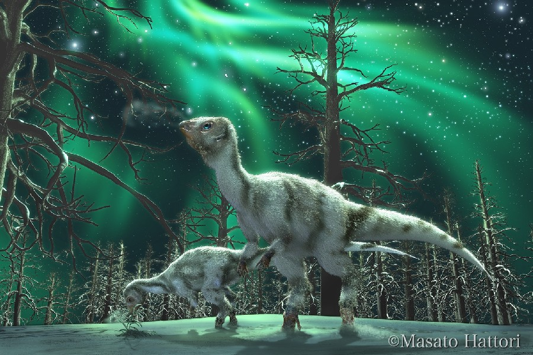

Der Leaellynasaura war ein kleiner Dinosaurier der in Australien von dem Ehepaar Thomas H. Rich und Patricia Vickers-Rich gefunden wurde. 1989 veröffentlichten sie die wissenschaftliche Erstbeschreibung. Das Ehepaar benannte ihn nach ihrer Tochter Leaellyn Rich.

Zur Zeit des Leaellynasaura war die Region in der er lebte ein Teil des polaren Gondwanalands. Er war also an kalte Temperaturen angepasst. Es war zwar nicht so kalt wie es heute in dieser Region ist, doch er musste mehre Monate im Dunklen leben. Das könnte seine großen Augen erklären. Der Leaellynasaura hatte große Augen die mit großen Gehirnregionen verbunden war. Ein Innenabdruck der Hirnschale zeigte, dass der Teil des Gehirns, der fürs Sehen zuständig war, ein größeres Maß hatte als der bei Menschen. So konnte der Leaellynasaura sich in den dunklen Monaten besser zurecht finden.

Der kleine Dinosaurier hatte einen sehr langen Schwanz. Der fast das dreifache seiner Körperlänge ausmachte. Er bestand aus mehr als 70 Wirbeln. Forscher vermuten, dass sein Schwanz, sowie der Körper des wendigen Dinosauriers mit Haar ähnlichen Filamenten besetzt war. Diese sollten ihn vor der Kälte wärmen. Es gab eine Theorie, dass der Leaellynasaura seinen Schwanz um seinen Körper geschlungen hatte um sich vor Kälteeinbrüchen zu schützen.

Quellen:

* <http://dinosaurs.wikia.com/wiki/Leaellynasaura>
* <http://www.wallpapers-free.co.uk/background/dinosaurs/strange/leaellynasaura/>
