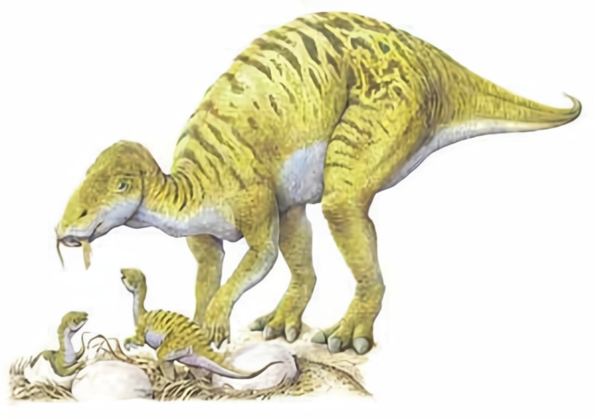

* typischer Entenschnabel, mit 2000 zähnen 🦷

gefunden 1979; 15 Jungtiere, ein Nest 

* etwa 4 Wochen alt, könnten wahrscheinlich noch nicht laufen, da Hüfte und Beinknochen noch nicht fest miteinander verbunden waren; zähne waren schon abgenutzt 🪺

griechische göttin Maia (gute Mutter) + weibliche Endung -> saura 

* neben den Skeletten einige nässer -> Annahme um Jungtiere wurde sich auch nachdem sie geschlüpft sind gekümmert (Nestlinge)🪺
* über 200 Individuen aller alterstufen Embryo bis zum adulten Tier〄
* Der **Maiasaura** war der erste Dinosaurier im Weltall. Seine Knochen wurden 1985 von Loren Acton bei der Spacelab2-Mission mit ins All genommen.

große Herden, möglich bis zu 10.000 Tieren

fehlende Verteidigungsmechanismen -> deshalb Herde

Koloniebrüten

kompakte nester

abstand zwischen Nestern nur ca 7m (ein Tier)

30-40 eier in einem Nest (spiralförmig angeordnet)

groß wie ein Straußenei

nach dem schlüpfen ca 40cm  1 kg groß, wuchsen in einem jähr um das dreifache _> möglicherweise Warmblütler

* studie 2015 jungtiere bipedal später Vierfüßler gang (quadruped)🪺

sämtliche Überreste aus mittleren Teil der Two-Medicine-Formation; ungefähr 76,4 Millionen Jahren; US bundestaat Montana

Erste Dinosauriergattung mit Belegen für Brutpflege

Brutwärme durch verrottende Pflanzen (nicht direkte Brut) (nicht wie bei Hühnern

* fester Scheitelkamm über den augen⽧
* abstammung unterschiedliche Meinungen, weißt Merkmale mit brachylophosaurus auf⫸

nahezu runde eier

Nest Durchmesser  1,80 m, kraterförmig

eier 15 cm

* hohe serblichkeitsrate in den ersten Jahren🪺

Maiasaura, ein Dinosaurier, der für seine mütterliche Fürsorge bekannt ist. Der Maiasaura ist ein 7-9 m langer Dinosaurier, der bis zu 3.000 kg schwer werden konnte. Er wurde 1979 von Laurie Trexie in der Two-Medicine-Formation, Montana entdeckt. Der erste Fund umfasste 15 Jungtiere und ein Nest.\
Der Maiasaura wurde nach der griechischen Göttin Maia "gute Mutter" benannt, zudem wurde die weibliche Form des lateinischen Wortes "saurier" gewählt. Daraus setzt sich der Name Maiasaura zusammen, der "gute Mutter-Echse" bedeutet.\
Außer dem muskulösem Schwanz hatte Maiasaura nichts, womit sie sich hätten verteidigen können. Deshalb Lebten diese Wesen wahrscheinlich in Herden. Diese konnten sogar bis zu 10.000 Tiere beherbergen. 

Durch die große Herde, bildeten sich auch automatisch Brutkolonien, also eine bestimmte Anzahl an Weiblichen Maiasaura, die gemeinsam ihre Jungtiere ausbrüteten. Maiasaura bauten, kraterförmige Nester, die einen Durchmesser von bis zu 1,8 m haben konnten. Da Maiasaura relativ groß war, konnte keine direkte Brut, wie bei Hühnern, stattfinden. Möglicherweise nutzten sie Pflanzen um ihre Eier abzudecken, so entstand eine Art Inkubator und die Eier hatten es schön warm.\
Zwischen den einzelnen Nestern waren nur sieben Meter Abstand, das machte es den Maiasaura vermutlich etwas schwer sich dazwischen zu bewegen, aber es könnte einen besseren Schutz gegeben haben.\
Maiasaura war die erste Dinosauriergattung mit Beleg für die Brutpflege.

In den Nestern befanden sich etwa 30-40 nahezu runde Eier, die so groß sind wie ein Straußenei. Nach dem Schlüpfen waren die Jungtiere etwa 40 cm groß und wogen in etwa 1 kg. Sie wuchsen im ersten Jahr aber um das dreifache, wobei sie den heutigen Vögeln sehr ähneln, deshalb wird vermutet, das Maiasaura Warmblütler gewesen sind.

Quellen:

* <https://www.deviantart.com/camusaltamirano/art/Maiasaura-peeblesorum-313569794>
* [https://ru.wikipedia.org/wiki/](https://ru.wikipedia.org/wiki/%D0%AD%D0%BA%D1%82%D0%BE%D0%BD,_%D0%9B%D0%BE%D1%80%D0%B5%D0%BD_%D0%A3%D0%B8%D0%BB%D0%B1%D0%B5%D1%80)
* <https://desciclopedia.org/wiki/Maiassauro>
