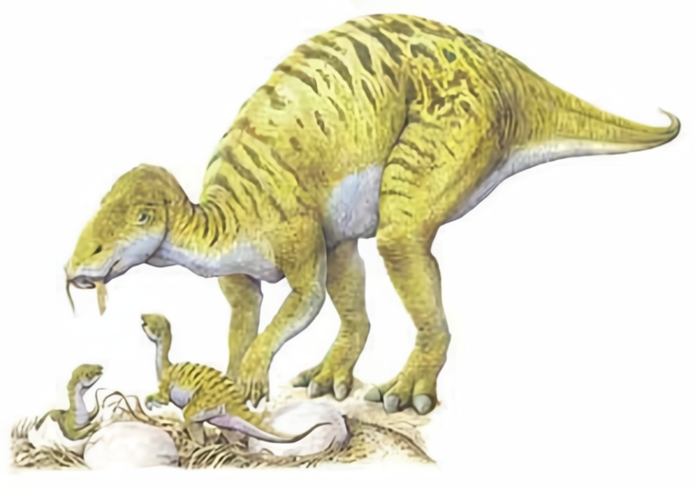
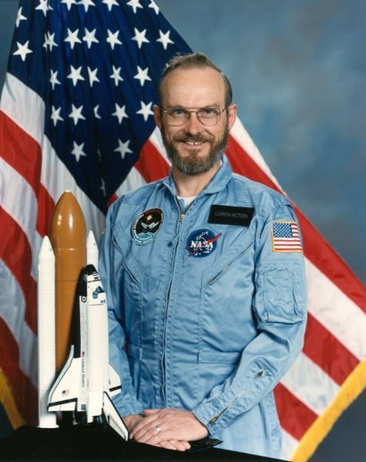

Der **Maiasaura** war ein Herdentier wie viele andere Hadrosaurier. Er zog nicht nur mit einer Herde, sondern brütete auch mit seinen Artgenossen zusammen. Die **Maiasaura** Mütter legten 30-40 Eier in ihre Lehmnester, die wie kleine Vulkane mit großem Krater aussahen.

In Montana wurden ungefähr 200 Skelette vom Ei bis zum erwachsenen **Maiasaura** entdeckt. Es war eine riesige Nistfläche.

Der **Maiasaura** hatte einen Entenschnabel, der mit bis zu 2000 Zähnen versehen war. Bei dem großen Fund in Montana hat man auch Junge gefunden, deren Zähne schon abgenutzt waren. Daher ist davon auszugehen, dass sie schon Pflanzen gefressen haben die sie von ihren Eltern bekamen.

Der **Maiasaura** war der erste Dinosaurier im Weltall. Seine Knochen wurden 1985 von Loren Acton bei der Spacelab2-Mission mit ins All genommen.

Quellen:

* <https://www.deviantart.com/camusaltamirano/art/Maiasaura-peeblesorum-313569794>
* [https://ru.wikipedia.org/wiki/](https://ru.wikipedia.org/wiki/%D0%AD%D0%BA%D1%82%D0%BE%D0%BD,_%D0%9B%D0%BE%D1%80%D0%B5%D0%BD_%D0%A3%D0%B8%D0%BB%D0%B1%D0%B5%D1%80)
* <https://desciclopedia.org/wiki/Maiassauro>
