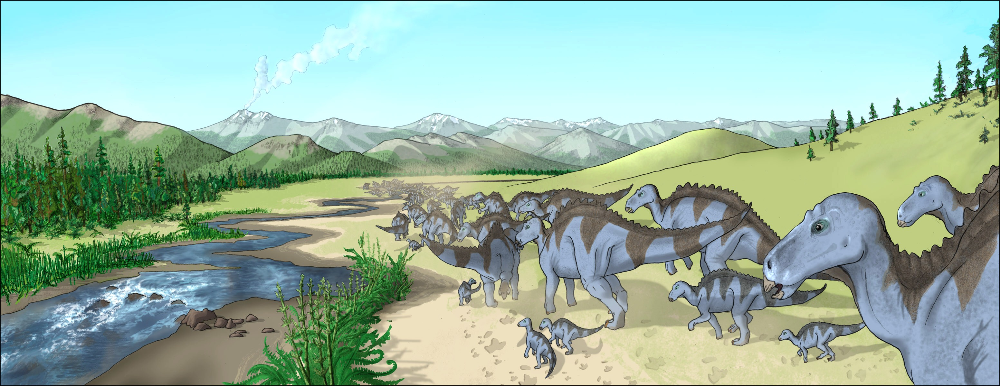
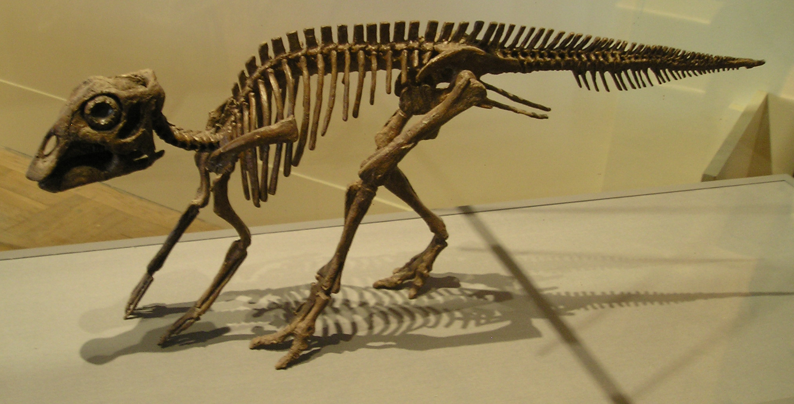

**Maiasaura**, ein Dinosaurier, der für seine mütterliche Fürsorge bekannt ist. Er wurde 1979 von Laurie Trexie in der Two-Medicine-Formation, Montana entdeckt. Der erste Fund umfasste 15 Jungtiere und ein Nest. Mittlerweile sind über 200 Individuen aus allen Altersstufen, vom Embryo bis zum adulten Tier, bekannt.
Der **Maiasaura** wurde nach der griechischen Göttin Maia "*gute Mutter*" benannt, zudem wurde die weibliche Form des lateinischen Wortes "*saurier*" gewählt. Daraus setzt sich der Name **Maiasaura** zusammen, der "*gute Mutter-Echse*" bedeutet.\
Der **Maiasaura** ist ein 7-9 m langer Dinosaurier, der bis zu 3.000 kg schwer werden konnte
Er weißt typische Merkmale von Hardrosauriern auf. Vor allem sein Entenschnabel mit 2.000 Zähnen macht ihn unverkennbar zum Hardrosaurier. Aber auch sein fester Scheitelkamm über den Augen ist ein typisches Merkmal. Wenn es um die Abstammung von **Maiasaura** geht, unterscheiden sich die Meinungen. Jedoch weißt **Maiasaura** eindeutige Gemeinsamkeiten mit Brachylophosaurus auf.

Außer dem muskulösem Schwanz hatte **Maiasaura** nichts, womit sie sich hätten verteidigen können. Deshalb lebten diese Wesen wahrscheinlich in Herden. Diese konnten sogar bis zu 10.000 Tiere umfassen. 

Durch die große Herde, bildeten sich auch automatisch Brutkolonien, also eine bestimmte Anzahl an Weiblichen **Maiasaura**, die gemeinsam ihre Jungtiere ausbrüteten. **Maiasaura** bauten, kraterförmige Nester, die einen Durchmesser von bis zu 1,8 m haben konnten. Da **Maiasaura** relativ groß war, konnte keine direkte Brut stattfinden, wie zum Beispiel bei Hühnern. Möglicherweise nutzten sie Pflanzen um ihre Eier abzudecken, so entstand eine Art Inkubator und die Eier hatten es schön warm.
Zwischen den einzelnen Nestern waren nur sieben Meter Abstand, das machte es den **Maiasaura** vermutlich etwas schwer sich dazwischen zu bewegen, aber es könnte einen besseren Schutz gegeben haben.
**Maiasaura** war die erste Dinosauriergattung mit Beleg für die Brutpflege.

In den Nestern befanden sich etwa 30-40 nahezu runde Eier, die so groß sind wie ein Straußenei. Nach dem Schlüpfen waren die Jungtiere etwa 40 cm groß und wogen in etwa 1 kg. Sie wuchsen im ersten Jahr aber um das dreifache, wobei sie den heutigen Vögeln sehr ähneln, deshalb wird vermutet, das **Maiasaura** Warmblütler gewesen sind.
Es wurden Exemplare von Jungtieren entdeckt, bei denen angenommen wird, dass sie gerade mal vier Wochen alt gewesen sein mussten. Ihre Hüfte- und Beinknochen waren noch nicht fest miteinander verbunden, weshalb sie sich wahrscheinlich noch nicht fortbewegen konnten. Ihre Zähne wiesen jedoch schon Verschleißspuren auf, woraus sich vermuten lässt, dass die Eltern ihre Jungtiere mit Futter versorgt haben mussten.
Eine Studie von 2015 erweckte die Überlegung, dass die Jungtiere sich bipedal, also auf zwei Beinen, fortbewegt haben konnten. Im Laufe ihres Wachstums sind sie dann zu einer quadrupeden Fortbewegung, dem Vierfüßler-Gang, übergegangen.
Forschungen ergaben, dass 90% der Jungtiere schon in ihrem ersten Jahr starben. Die hohe Sterblichkeitsrate konnte viele Gründe haben, zum Beispiel konnten die Jungtiere von anderen Raubsauriern, wie Daspletosaurus, gejagt worden sein, oder sie waren nicht selbständig genug und waren immer auf ältere angewiesen, es gibt verschiedenste Möglichkeiten.

Der **Maiasaura** war der erste Dinosaurier im Weltall. Seine Knochen wurden 1985 von Loren Acton bei der Spacelab2-Mission mit ins All genommen.
