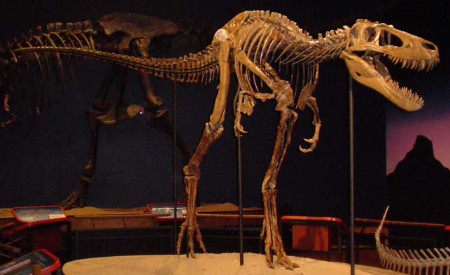

Der **Nanotyrannus** war ein kleiner Tyrannosaurier, oft wird er als der kleine Bruder vom [Tyrannosaurus Rex](/dinos/tyrannosaurus-rex/) bezeichnet. Er lebte vor etwa 80 Millionen Jahren während der Kreidezeit im heutigen Nordamerika.

Der **Nanotyrannus** war vermutlich ein Raubtier und jagte andere Dinosaurier, um zu überleben. Er hatte lange und kräftige Hinterbeine, was darauf hindeutet, dass er schnell laufen und springen konnte und damit ein hervorragender Jäger war. Durch seine kleine Größe war er schneller und wendiger als ein Tyrannosaurus Rex. Dies könnte bei der Jagd auf schnelle Beute von Vorteil gewesen sein. Sein kräftiger Kiefer und seine Zähne deuten auf eine fleischhaltige Ernährung hin. Es wird auch vermutet, dass der **Nanotyrannus** in Rudeln gejagt hat, da Zähne von verschiedenen Individuen an einem Ort gefunden wurden.

Das erste Exemplar eines **Nanotyrannus** wurde 1946 von Charles W. Gilmore entdeckt. Es bestand nur aus einem kleinem Schädel und wurde ursprünglich dem Gorgosaurus zugeordnet. Erst 1998 fanden Robert T. Bakker, Phillip Currie und Michael Williams bei weiteren Untersuchungen heraus, das es sich um eine neue Gattung handelt. Andere Forscher bezweifelten jedoch diese Zuordnung und nehmen häufig an, es handle sich bei **Nanotyrannus** um einen jungen Tyrannosaurus Rex. Erst durch die Entdeckung weitere Fossilien im Jahr 2001 in Rockford (Illinois, USA) wurde die Gültigkeit von **Nanotyrannus** als eigene Art bestätigt. Die gefundenen Fossilien hatten mehr Zähne im Ober- und Unterkiefer als ein erwachsener T-Rex. Der **Nanotyrannus** hatte zwischen 14 und 15 Zähne im Kiefer, während ein T. Rex nur zwischen 11 und 12 Zähne pro Kiefer hatte.

Es sind nur wenige Fossilien vom **Nanotyrannus** gefunden worden. Dadurch ist eine genauere Beschreibung des Aussehens, der genauen Lebensweise und seines Verhalten nur schwer möglich.
