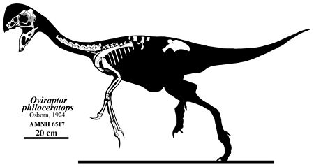

Der **Oviraptor** war wie viel andere *Oviraptoren* ein vogelähnlicher Theropode, mit zahnlosem Kiefer und einem Schädelkamm. Die Nahrung des **Oviraptors** ist noch unklar, doch einige Forscher vermuten, des der **Oviraptor** mit seinem Schnabel Muscheln und Schnecken aufgeknackt haben könnte.

Der **Oviraptor** wurde 1923 von Georg Olsen in der berühmten Fossillagerstätte Bajandsag gefunden. Vom **Oviraptor** sind bis jetzt nur ein teilweise erhaltenes Skelett und ein unvollständiger, deformierter Schädel bekannt.

 Der **Oviraptor** wurde neben einem Nest mit 15 Eiern entdeckt. Deshalb vermuteten die Paläontologen das der **Oviraptor** die Eier fressen wollte. Deshalb bekam er den Namen „*Oviraptor*“, das so viel wie „*Eierdieb*“ bedeutet. Diese These war jedoch falsch. Später fand man heraus das es sich um ein Elterntier handelte, das sich um seine Eier kümmerte als es starb. Man vermutet das **Oviraptoren**, wie Seevögel in Kolonien gebrütet haben, da man noch weitere Nester nah bei einander gefunden hat.

Da es zur Zeit als der **Oviraptor** gefunden wurde noch keine Gruppe gab die er zugeordnet werden konnte. Wurde die Gruppe nach ihm benannt.

2021 wurde überraschend ein Dinosaurier Ei der Gruppe *Oviraptoridae* in einem Lager einer chinesischen Steinbruchfirma gefunden.

Quellen:

* <https://www.deviantart.com/camusaltamirano/art/Oviraptor-philoceratops-382396255>
* <https://de.wikipedia.org/wiki/Oviraptor>
