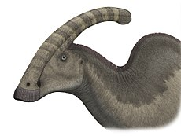

 Der **Parasaurolophus** konnte sich wahrscheinlich wie viele andere Hardrosaurier auf zwei und auf vier Beinen fortbewegen. Ein typisches Merkmal der Hardrosaurier hatte auch der **Parasaurolophus**, denn er besaß einen "Entenschnabel" mit Mahlzähnen im Kiefer.

Sein auffälligstes Merkmal ist der nach hinten gerichtete Kamm. Wegen seines Erscheinungsbild ist der **Parasaurolophus** bei vielen Menschen bekannt. Der **Parasaurolophus** zogen vermutlich in Herden durch die Waldländer und konnte die mit seinem auffälligen Kamm auf dem Kopf warnen wen Gefahr drohte oder die Herde weiter ziehen wollte.

Quellen:

* <https://www.deviantart.com/camusaltamirano/art/Parasaurolophus-walkeri-303527751>
* <https://hu.wikipedia.org>
