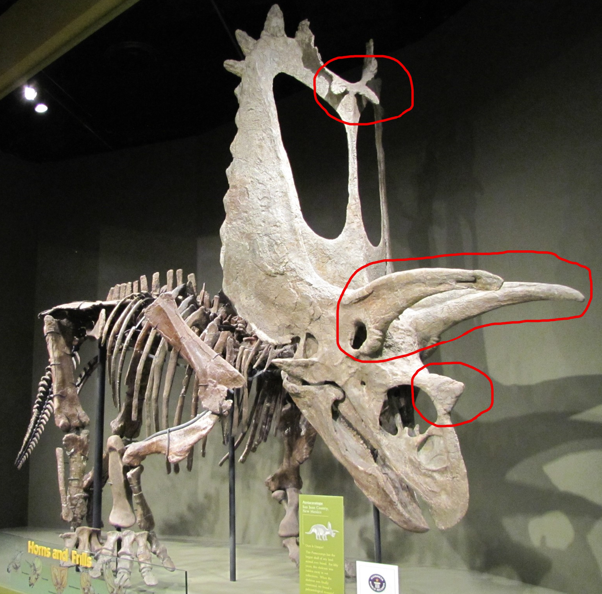

Der **Pentaceratops** hatte den größten Kopf aller Landbewohner, das Schild mit eingerechnet. Der circa zwei Meter lange Schädel hatte an den breiten Enden des Schildes viel kleine Dornen. Am äußern Rand, in der Mitte des Schildes, gab es eine kleine Einbuchtung in der zwei kleine Hörner saßen. In dem gigantischen Schild waren zwei Öffnungen, sogenannte *Fenestrae,* allerdings konnte man die Öffnungen nicht sehne, da sie mit Haut überspannt waren. Die Öffnungen machten den ganzen Schädel leichter. Über den Augen saßen wie bei dem [Triceratops](/dinos/triceratops/)zwei weitere, etwas größere Hörner und ein weiteres, saß über den Nasenlöchern.

Der Name **Pentaceratops** leitet sich von den griechischen Wörtern für „*fünf*“ und „*Horn*“ ab.   Die fünf Hörner sind die zwei großen über den Augen, das kleiner Horn oberhalb der Nasenlöcher und die zwei nach unten gebogenen Hörner in der Einkerbung am Rand des Schildes.

Von den **Pentaceratopsier** sind keine bone beds (“*Knochenlager*”) bekannt. Daraus wird geschlossen, das die **Pentaceratopsier** Einzeltiere waren und sich nur zur Paarung getroffen haben. Bei vielen *Ceratopsias* vermutet man, dass das Schild zur Verteidigung gedient hat, aber bei den **Pentaceratopsier** war das Nacken Schild zu dünn um zur Verteidigung gedient zu haben. Auch die Wangenhörne und die Schildrandhörner waren unpraktisch für Kämpfe.

Quellen:

* <https://no.wikipedia.org/wiki/Campanium>
* <https://commons.m.wikimedia.org/wiki/File:Titanoceratops.jpg>
