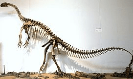

Der **Plateosaurus** gehört zu der Gruppe der Plateosauridae. Er ist einer der Größten seiner Art. Die Besonderheit des **Plateosaurus** war, dass er auf seinen Hinterbeinen lief und nicht wie die meisten Dinosaurier auf allen Vieren. Er konnte wie ein Känguru auf seinen Hinterbeinen stehen, um an Bäume zu kommen, falls es keine Blätter an niedrigeren Pflanzen gab.

Quellen:

* <https://nl.wikipedia.org/wiki/Prosauropoda>
* <https://vi.wikipedia.org/wiki/Plateosaurus>
