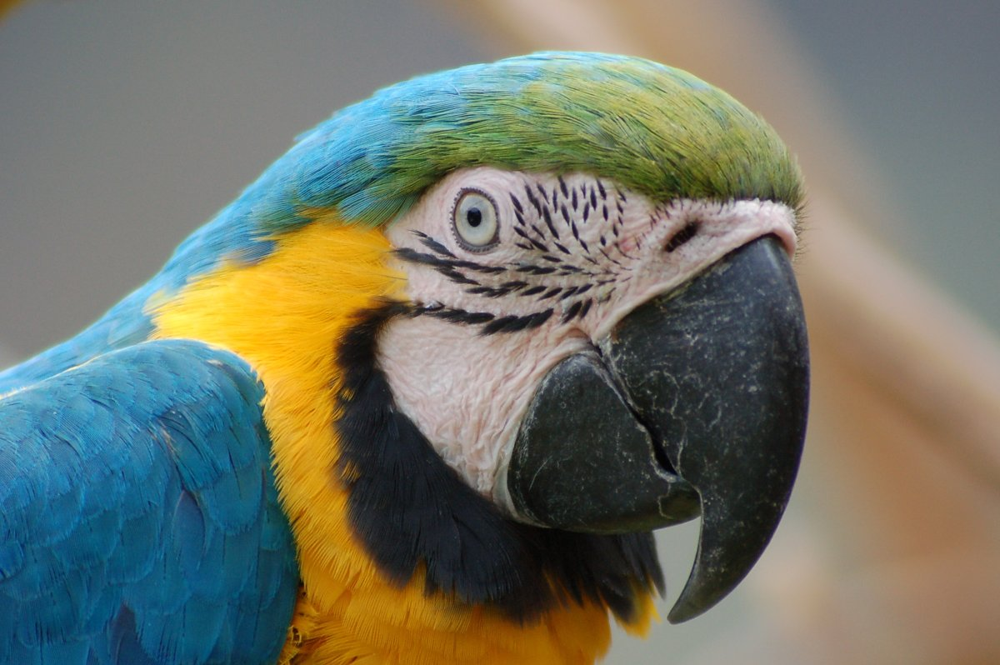
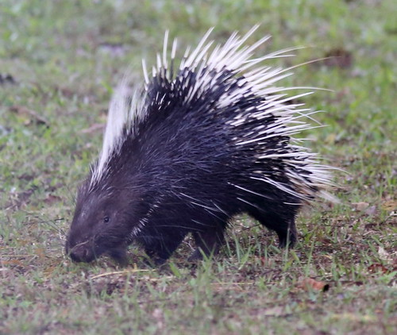

Der **Psittacosaurus** ist mit dem [Triceratops](/dinos/triceratops/) und dem [Kosmoceratops](/dinos/kosmoceratops/) verwand, denn sie gehören alle zu der Ceratopsia Gruppe. Der **Psittacosaurus** hatte einen Schnabel wie ein Papagei.

Der **Psittacosaurus** hat auch einen Schwanz der mit Stacheln bedeckt war, ähnlich wie bei einem Stachelschwein, mit dem er sich vermutlich verteidigt hat.

Vermutlich hat der **Psitacosaurus** Steine gefressen, damit sie die Blätter und andere Pflanzenteile zermahlten.

Quellen:

* <https://piqs.de>
* <https://www.flickr.com>
* <https://culturacientifica.com>
