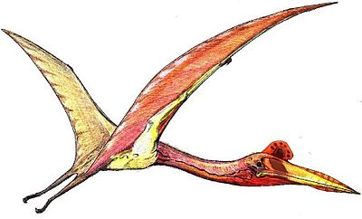

Der **Quetzalcoatlus** hatte riesige Flügel, die eine Spannweite bis zu 13m lang haben konnten. Während er über verschieden große Dinos hinweg flog, hielt er nach kleinen Dinosaurier, Fischen, Krebsen und Weichtieren, als Nahrung Ausschau. Der **Quetzalcoatlus** hatte auch einen sehr großen Schnabel und leichte Knochen, die das Fliegen noch erleichterten.

Quellen:

* <http://mesozoicmondays.blogspot.com/2013/03/q-is-for-quetzalcoatlus.html>
* [https://fr.vikidia.org/wiki/Quetzalcoatlu](https://fr.vikidia.org/wiki/Quetzalcoatlus)
