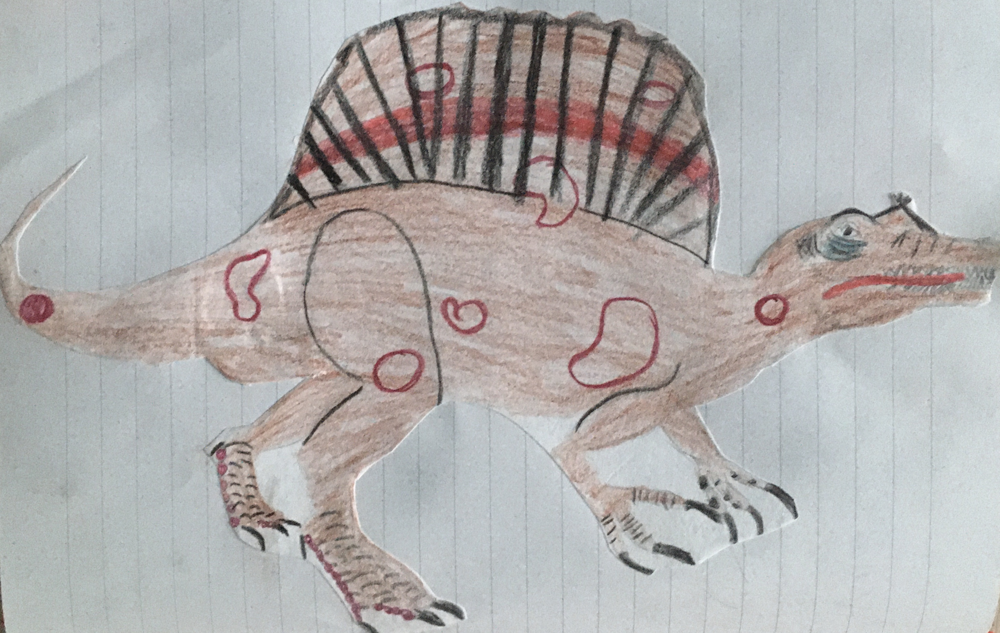
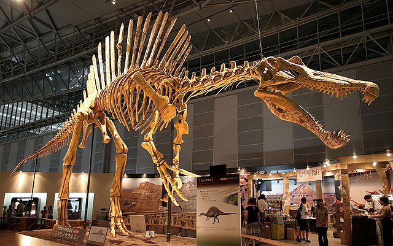

Auf dem Rückenskelett hatte der **Spinosaurus** bis zu 1,6m lange Knochen. Zusammen ergaben diese die Form eines großen Segels. Wahrscheinlich half es ihm bei der Jagt nach Fischen im Wasser. Seine Nahrung bestand jedoch nicht nur aus Fisch sondern auch noch aus anderen kleinen Tieren aus dem Wasser.

Der **Spinosaurus** war größer als der [Tyrannosaurus Rex](/dinos/tyrannosaurus-rex/) und der [Giganotosaurus,](/dinos/giganotosaurus/) dadurch der größte Räuber der je auf dem Festland gelebt hatte.

Das erste Skelett wurde 1912 in Ägypten von Richard Markgraf entdeckt. Das zweite Skelett kurz später 1915 von dem deutschen Paläontologe Ernst Sromer, es wurde jedoch im zweiten Weltkrieg bei einem Bombenangriff zerstört.

Quellen:

* <https://www.flickr.com/photos/paleopeter/8452997339>
* <https://commons.wikimedia.org/wiki/File:Spinosaurus_skeleton.jpg>
