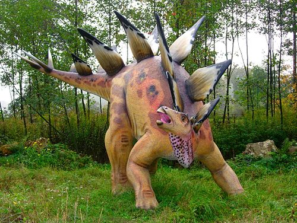
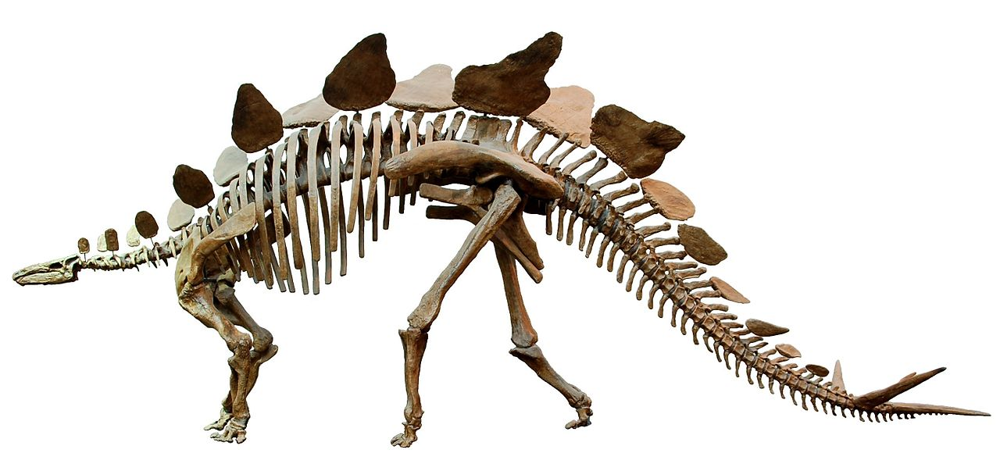

Der **Stegosaurus** war ein ein Pflanzenfresser und hatte keine Zähne in seinem Schnabel, doch ganz hinten in seinem Maul hatte er reihenweise Zähne, mit denen er Blätter zermahlen konnte.

 Das Erkennungsmerkmal des **Stegosaurus** waren seine Platten auf dem Rücken. Die vermutlich nicht zur Verteidigung gedient haben, sondern zur Anlockung von weiblichen **Stegosauriern**.

Quellen:

* <https://www.deviantart.com/camusaltamirano/art/Stegosaurus-armatus-307781060>
* <https://commons.wikimedia.org/wiki/File:Stegosaurus_Senckenberg_white_background.jpg>
