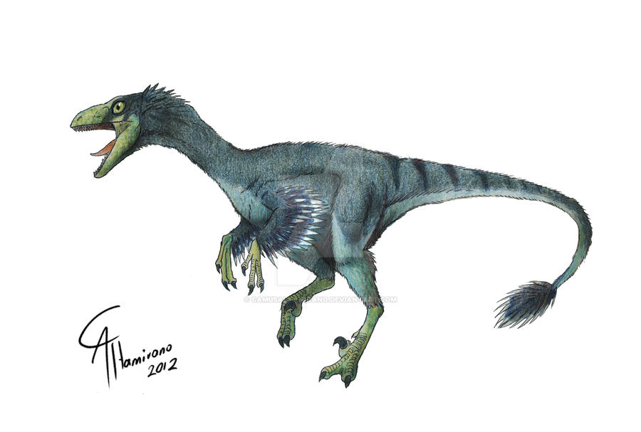
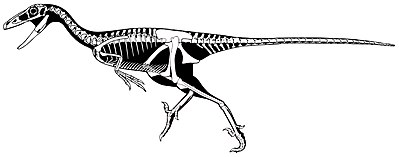

Das **Troodon** war etwa 2,5-3 m lang und das errechnete Gewicht liegt bei 35-45 kg. Wie bei dem **Deinonychus**,hatte das **Troodon** drei Zehen an jedem der zwei Beine, mit einer sichelförmigen Kralle. Eswar ausgestattet mit drei zum Greifen geeigneten Fingern, sowie scharfen, spitzen Zähnen, nach denen es auch benannt ist.

Einige Wissenschaftler vermuten, dass das **Troodon** eines der am weitesten entwickelten Dinosaurier war und eine ähnliche Intelligenz, wie bei den heutigen Vögeln hatte. Das **Troodon** hatte ein großes Gehirn (0,1% des Körpergewichtes) und sehr große Augenhöhen. Man vermutet das es nachtaktiv war. Die Augen des **Troodons** standen etwas hervor, so das anzunehmen ist, dass es räumlich sehen konnte. Das **Troodon** hatte nicht nur große Augenhöhlen und in ziemlich großes Gehirn, es hatte auch große Nasenöffnungen. Es ist davon auszugehen, dass das **Troodon** einen ausgeprägten Geruchssinn hatte.

Joseph Leidy fand 1856 einen Zahn des **Troodons**. Er hielt den Zahn jedoch für den einer Eidechse. Der Zahn wurde allerdings als *Troödon* beschrieben. Est 1877 wurde der Zahn als Dinosaurier-Zahn identifiziert.

Quellen:

* <https://reyesjoe.blogspot.com/2016/08/troodon.html>
* <https://nl.wikipedia.org/wiki/Troodon>
* <https://www.deviantart.com/camusaltamirano/art/Troodon-formosus-307779433>
