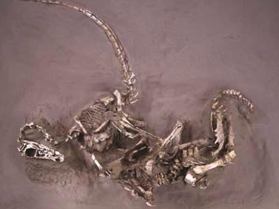

Der **Velociraptor** ist ein sehr bekannter Dinosaurier, doch viele Menschen wissen nicht wie klein er tatsächlich wär. Der **Velociraptor** wurde 0,6m hoch und maximal 2m lang, er hatte ein Gewicht von 15kg. In Jurassic Park spielte der **Velociraptor** eine große Rolle, allerdings wurde er in den Filmen doppelt so groß dargestellt.

Es gab einen beeindruckenden Fund in der Mongolei, dort fand man einen **Velociraptor**, der mit einem [Protoceratops](/dinos/protoceratops/) kämpfte.  

Beide starben in diesem Kampf, vermutlich wurden sie von einem Sandsturm überrascht.

Der **Velociraptor** hatte gebogene Krallen an seinen Armen, mit denen er seine Beute festhalten und zerreißen konnte. Der **Velociraptor** fraß nicht nur seine eigene Beute, sondern auch die Überreste anderer Tiere.

Der **Velociraptor** besaß vermutlich ein Federkleid, das ihm Tarnung verlieh. Der Fund wies keine Federn auf, allerdings konnte man an den Armknochen Ansatzstellen für große Federn entdecken.

Der **Velociraptor** erreichte eine Geschwindigkeit von 60 kph, damit war er ungefähr so schnell wie ein Hase.
