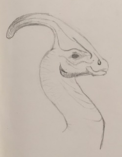

# Über mich

Hallo, ich bin Mia und wohne in Leipzig. Ich interessiere mich für Dinosaurier seit ich 5 Jahre alt bin. Ich lese viel über die Bedeutungen der Namen und andere spannende Fakten in Büchern und im Internet. Am Anfang hatte ich Angst vor den gigantischen Wesen, doch dann habe ich die Serie "[Dino Dana](http://dinodana.com)" für mich entdeckt. Seitdem habe ich eine große Sammlung an Büchern über Dinosaurier. Mein Lieblings-Dino ist der Parasaurolophus, doch es gibt noch sehr viele andere tolle Dinosaurier, die ich interessant finde.

Mein Traum ist es Paläontologin zu werden. Hier, über meine Webseite möchte ich das Wissen was ich über Dinosaurier habe, mit euch teilen, damit sich immer mehr Menschen für Dinosaurier begeistern.

Eure Mia
